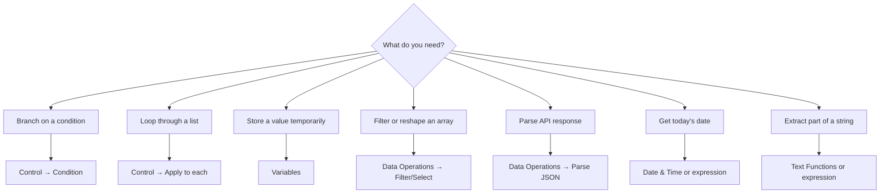

# Built-in Tools Overview

Standard Always Available

Built-in tools are available in **every** Power Automate plan — no premium connector needed. They form the logic backbone of every flow.

---

## Built-in Categories

| Category | Purpose |
|----------|---------|
| [Control](control) | Conditions, loops, branching, error scopes |
| [Variables](variables) | Store and manipulate values during the flow |
| [Data Operations](data-operations) | Transform, filter, join arrays and JSON |
| [Date & Time](date-time) | Time math, time zone conversion, formatting |
| [Text Functions](text-functions) | Substring, find position |
| Schedule | Recurrence trigger (time-based) |
| HTTP / Request | HTTP trigger (webhook inbound) |

---

## When to Use What

