# Control — Conditions, Loops, and Scopes

<span class="badge badge-blue">Built-in</span> <span class="badge badge-green">Core</span>

Control actions manage the **flow of execution** — branching, looping, grouping, and terminating.

---

## All Control Actions

| Action | Description |
|--------|-------------|
| `Condition` | if/else — two branches based on a true/false check |
| `Switch` | Multi-branch — like a switch/case statement |
| `Apply to each` | Loop over every item in an array |
| `Do until` | Loop until a condition becomes true |
| `Scope` | Group actions into a named block |
| `Terminate` | End the flow immediately with a status |

---

## Condition


**Expression examples for the condition:**

```
# String equal
@equals(triggerBody()?['Status'], 'Active')

# Number greater than
@greater(triggerBody()?['Amount'], 1000)

# Contains substring
@contains(triggerBody()?['Email'], '@company.com')

# Is not empty
@not(empty(triggerBody()?['AttachmentId']))

# Date comparison
@greater(triggerBody()?['DueDate'], utcNow())
```

> 💡 Use **advanced mode** in the Condition to write full expressions. Basic mode only supports simple equality checks.

---

## Switch

Use `Switch` when you have 3+ possible values — cleaner than nested Conditions:


**Switch value expression:**
```
@{triggerBody()?['Department']}
```

Each **Case** has a value (e.g., `Sales`, `IT`, `HR`) and its own set of actions. The **Default** case catches anything that doesn't match.

---

## Apply to Each

Loops over every item in an array. The most-used control action.

```mermaid
graph LR
    ARR[Array: 5 items] --> EACH
    subgraph EACH [Apply to each]
      direction TB
      A1[Item 1 → actions]
      A2[Item 2 → actions]
      A3[…]
    end
```



**Inside the loop**, use `items('Apply_to_each')` or the dynamic content `Current item` to reference the current element.

```
# Access a field on the current item
items('Apply_to_each')?['Title']

# Access nested field
items('Apply_to_each')?['Author']?['DisplayName']
```

### Concurrency (Parallelism)

By default, `Apply to each` processes items **one at a time**. To speed it up:
1. Click the `···` menu on the action
2. **Settings → Concurrency Control: On**
3. Set **Degree of Parallelism** up to 50

> ⚠️ When concurrency > 1, you **cannot write to variables** inside the loop — outputs will be unpredictable. Use `Compose` or append to an array variable only from the main thread.

---

## Do Until

Loops until a condition becomes true — use when you don't know how many iterations you need.

**Common use: polling for a result**

```
Initialize: checkCount = 0

Do until:
  jobStatus equals 'Complete'
  OR checkCount > 10        ← safety exit!

  Inside the loop:
    HTTP GET /api/jobs/status → set jobStatus
    Increment checkCount
    Delay (1 minute)
```

> ⚠️ Always set a **maximum count** (e.g., `checkCount > 20`) and a **timeout** in Do Until settings. Without a safety exit, the loop can run forever.

---

## Scope — Try/Catch Pattern

`Scope` groups actions into a named block. Its real power is **error handling**:

```mermaid
graph TD
    TRY[Scope: Try\n- Get SP item\n- Send email\n- Update record]
    TRY -->|Success| NEXT[Continue flow]
    TRY -->|Failure| CATCH[Scope: Catch\n⚙️ run after: has failed\n- Log error to list\n- Notify admin]
```



**How to set up:**
1. Add a `Scope` and put your main actions inside it — name it `Try`
2. Add another `Scope` after it — name it `Catch`
3. On the `Catch` scope: click `···` → **Configure run after** → uncheck ✅ is successful, check ❌ has failed

**Inside the Catch scope, read the error:**
```
@{result('Try')?[0]?['error']?['message']}
```

For a complete error handling guide: [→ Error Handling Pattern](patterns/error-handling)

---

## Terminate

Immediately ends the flow with a chosen status:

```json
Action: Terminate
Status: Failed
Code: VALIDATION_ERROR
Message: "Required field 'Email' is missing"
```

| Status | Use case |
|--------|---------|
| `Succeeded` | Early exit when no more work needed |
| `Failed` | Indicate the flow failed intentionally |
| `Cancelled` | Graceful abort |

> ⚠️ After `Terminate`, no subsequent actions run. Use it only at decision points where you want to stop everything.

---

## Pro Tips

- **Name your actions clearly** — `Apply to each - Process invoices` is much easier to debug than `Apply to each 3`.
- In **Condition**, prefer `@equals()` expressions over the basic editor — they handle null values more predictably.
- Use **`Switch`** over nested `Condition` whenever you have 3+ branches — the flow diagram stays readable.
- Set a **timeout** on `Do until` (Settings → Timeout) in addition to a counter — two layers of protection against infinite loops.
- **Scope** is free — use it liberally to organize long flows into logical sections even when you don't need error handling.
