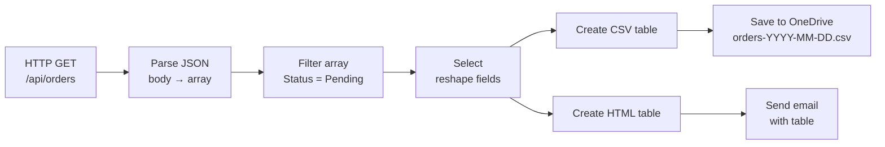

# Data Operations

<span class="badge badge-blue">Built-in</span> <span class="badge badge-purple">Power Feature</span>

Data Operations transform, filter, and reshape data in your flows — without loops or variables in many cases.

---

## All Actions

| Action | One-liner |
|--------|-----------|
| `Compose` | Evaluate and store any expression result |
| `Parse JSON` | Turn a JSON string into usable dynamic content |
| `Filter array` | Keep only items matching a condition |
| `Select` | Reshape each item in an array (pick/rename fields) |
| `Join` | Concatenate array items into a single string |
| `Create CSV table` | Convert array to CSV text |
| `Create HTML table` | Convert array to an HTML table string |

---

## Compose

The simplest but most versatile action — evaluate any expression and refer to the result later.

```json
Inputs: @{formatDateTime(utcNow(), 'yyyy-MM-dd')}
```

Reference: `outputs('Compose_today')`

**Use cases:**
- Cache a complex expression so you don't repeat it
- Build a JSON object to use as an action input
- Debug — compose an expression and check its value in the run history

```json
# Build a complex object
Inputs:
{
  "reportDate": "@{formatDateTime(utcNow(), 'yyyy-MM-dd')}",
  "totalItems": @{length(variables('itemList'))},
  "requestedBy": "@{triggerBody()?['Author/DisplayName']}"
}
```

---

## Parse JSON

Turns a raw JSON **string** into structured data with fields you can click in the dynamic content panel.

**Step 1:** Add the action and paste sample JSON into "Generate from sample":

```json
{
  "id": 42,
  "name": "Alice",
  "roles": ["Admin", "Editor"],
  "address": {
    "city": "Istanbul",
    "country": "TR"
  }
}
```

**Step 2:** Power Automate generates the schema automatically.

**Step 3:** Use `name`, `roles`, `address/city` etc. as dynamic content in all subsequent actions.

> ⚠️ If the actual JSON doesn't match the schema (extra/missing fields), the action may fail. Use `coalesce(body('Parse_JSON')?['field'], '')` for optional fields.

---

## Filter Array

Remove items from an array that don't meet a condition. Think of it as SQL `WHERE` for arrays.

```
From:       @{body('Get_items')?['value']}
Condition:  @{item()?['Status']}  is equal to  Active
```

**Advanced mode expression:**
```
@equals(item()?['Status'], 'Active')
@greater(item()?['Amount'], 1000)
@contains(item()?['Tags'], 'urgent')
@not(empty(item()?['AssignedTo']))
```

**Multi-condition (AND):**
```
@and(
  equals(item()?['Status'], 'Active'),
  greater(item()?['Priority'], 2)
)
```

Result: a filtered array — use with `Apply to each` or `length()` to count matches.

---

## Select — Reshape an Array

Transform each item in an array to a new shape. Like `Array.map()` in JavaScript.

**Input array:**
```json
[
  { "Id": 1, "Title": "Task A", "AssignedTo": { "DisplayName": "Alice" }, "Priority": 2 },
  { "Id": 2, "Title": "Task B", "AssignedTo": { "DisplayName": "Bob"   }, "Priority": 1 }
]
```

**Select mapping:**
```json
{
  "id":        "@{item()?['Id']}",
  "title":     "@{item()?['Title']}",
  "assignee":  "@{item()?['AssignedTo']?['DisplayName']}",
  "urgent":    "@{if(less(item()?['Priority'], 2), 'Yes', 'No')}"
}
```

**Output:**
```json
[
  { "id": 1, "title": "Task A", "assignee": "Alice", "urgent": "No" },
  { "id": 2, "title": "Task B", "assignee": "Bob",   "urgent": "Yes" }
]
```

---

## Join

Flatten an array into a single string with a separator.

```
From:      @{variables('tagList')}     →   ["urgent", "review", "Q4"]
Join with: ", "
Result:    "urgent, review, Q4"
```

Perfect for putting multi-value fields into an email body or a CSV column.

---

## Create CSV Table

Convert an array to a CSV string — great for email attachments or file exports.

```json
From:    @{body('Filter_array')}
Columns: Automatic (uses all keys) or Custom
```

**Custom columns:**
```
Column 1: Name     → @{item()?['Title']}
Column 2: Assignee → @{item()?['AssignedTo/DisplayName']}
Column 3: Due Date → @{formatDateTime(item()?['DueDate'], 'yyyy-MM-dd')}
```

Combine with OneDrive `Create file` (`.csv`) or Outlook `Send email` (base64-encoded attachment).

---

## Create HTML Table

Same as CSV but outputs `<table>` HTML — paste directly into an email body:

```json
From:    @{body('Filter_array')}
Columns: Custom (with same format as CSV)
```

Then in Outlook `Send an email`:
```
Body: <h2>Weekly Summary</h2>
      @{body('Create_HTML_table')}
Is HTML: Yes
```

---

## Full Pipeline Example



---

## Pro Tips

- Use **`Compose`** to cache complex expressions — reference with `outputs('Compose_name')` instead of repeating the expression everywhere.
- **`Select`** + **`Filter array`** are much faster than `Apply to each` + `Condition` — they're optimized native operations.
- Use **`length(body('Filter_array'))`** to count results without looping.
- Combine **`Select`** → **`Join`** to build a comma-separated list of values from an array field.
- Use **`union(array1, array2)`** (expression) to merge two arrays — no action needed.
