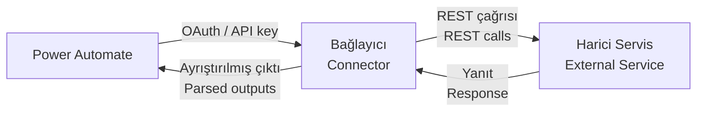

# Bağlayıcılar / Connectors

Referans / Reference

## Bağlayıcı Nedir? / What is a Connector?

**TR:** Bağlayıcı, Power Automate'in bir harici servisle konuşabilmesi için gereken "tercüman"dır. SharePoint, Teams, SQL Server gibi servislerle kimlik doğrulamayı, mevcut işlemleri ve veri biçimlendirmeyi bağlayıcı yönetir — siz sadece ne yapmak istediğinizi seçersiniz.

**EN:** A connector is the "translator" that lets Power Automate talk to an external service. It handles authentication, defines available operations, and formats data in and out — you just pick what you want to do.

Power Automate'te **1.000'den fazla bağlayıcı** bulunur / Power Automate has **1,000+ connectors**: Microsoft ürünleri, üçüncü taraf SaaS uygulamaları ve şirket içi sistemler / Microsoft products, third-party SaaS apps, and on-premises systems.

---

## Standart mı, Premium mı? / Standard vs Premium

| Tür / Type | Gereken Lisans / License | Örnekler / Examples |
|------------|--------------------------|---------------------|
| **Standard** | Herhangi bir M365 planı / Any Microsoft 365 plan | SharePoint, Teams, Excel, OneDrive, Outlook |
| **Premium** | Power Automate Premium | SQL Server, Dataverse, HTTP, AI Builder, Salesforce, SAP |
| **Custom / Özel** | Premium | Kendi REST API'niz / Your own REST API |

> 💡 **TR:** Premium bağlayıcıları tanımak için bağlayıcı seçicide elmas simgesine ♦ bakın. / **EN:** Look for the diamond ♦ icon in the connector picker — that marks Premium connectors.

---

## Bu Wiki'de Kapsanan Bağlayıcılar / Covered in This Wiki

| Bağlayıcı / Connector | Tür / Type | Ne İçin / Main Use | Sayfa / Page |
|-----------------------|------------|--------------------|--------------|
| SharePoint | Standard | Liste, kitaplık, dosya / Lists, libraries, files | [→](connectors/sharepoint) |
| Microsoft Teams | Standard | Mesaj, kart, onay / Messages, cards, approvals | [→](connectors/teams) |
| Excel Online (Business) | Standard | Tablo okuma/yazma / Tables, rows, reports | [→](connectors/excel-online) |
| OneDrive for Business | Standard | Dosya yönetimi / File management, PDF convert | [→](connectors/onedrive) |
| Microsoft Dataverse | Premium | CRM/ERP verisi / CRM/ERP data, Dynamics 365 | [→](connectors/dataverse) |
| SQL Server | Premium | Veritabanı / Relational DB queries, stored procs | [→](connectors/sql-server) |
| Azure DevOps | Standard | İş kalemi, pipeline / Work items, pipelines | [→](connectors/azure-devops) |
| HTTP | Premium | Herhangi REST API / Any REST API, webhooks | [→](connectors/http) |
| AI Builder | Premium | GPT, belge AI, duygu / GPT, document AI, sentiment | [→](connectors/ai-builder) |

---

## Bağlayıcılar Nasıl Çalışır? / How Connectors Work Internally

**TR — Bağlayıcı şunları otomatik yönetir:**

- Kimlik doğrulama / Authentication (OAuth 2.0, API key, Basic auth)
- Kısıtlama / hız sınırlama / Throttling & rate limiting
- Yeniden deneme mantığı / Retry logic
- Yanıt ayrıştırma / Response parsing

---

## Bağlantı Yönetimi / Managing Connections

**TR:** Bağlantı, Power Automate'in bir servise erişmek için kullandığı kimlik bilgilerini saklar. Bağlantıları yönetmek için:

**EN:** A connection stores credentials for accessing a service. Manage connections at:

**[make.powerautomate.com](https://make.powerautomate.com) → Veri / Data → Bağlantılar / Connections**

- Tüm kimlik doğrulanmış bağlantıları görün / See all authenticated connections
- Bozuk bağlantıları düzeltin / Fix broken connections (re-authenticate)
- Kullanılmayan bağlantıları silin / Delete unused connections
- Bağlantıları paylaşın / Share connections with other users

> ⚠️ **TR:** Bir bağlantı sona ererse, o bağlantıyı kullanan **tüm akışlar başarısız olur**. Üretim ortamında bağlantı sağlığını düzenli izleyin. / **EN:** If a connection expires, **all flows using it will fail**. Always monitor connection health in production.

---

## Hangi Bağlayıcıyla Başlamalıyım? / Where to Start

**TR:**
- **SharePoint** — Microsoft 365 kullanan şirketler için en yaygın başlangıç noktası
- **Teams** — bildirim ve onay akışları için en hızlı sonuç
- **Excel Online** — veriyi zaten Excel'de tutanlar için ideal
- **HTTP** — özel bağlayıcısı olmayan herhangi bir REST API için

**EN:**
- **SharePoint** — most common starting point for Microsoft 365 organizations
- **Teams** — fastest results for notifications and approvals
- **Excel Online** — ideal if your data already lives in Excel
- **HTTP** — connect to any REST API without a dedicated connector
