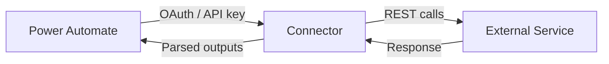

# Connectors Overview

Reference

A **connector** is a pre-built wrapper around a service's API. Power Automate has **1,000+ connectors** covering Microsoft products, third-party SaaS apps, and on-premises systems.

---

## Standard vs Premium

| Type | License needed | Examples |
|------|---------------|---------|
| **Standard** | Any Microsoft 365 plan | SharePoint, Teams, Excel, OneDrive, Outlook |
| **Premium** | Power Automate Premium | SQL Server, Dataverse, HTTP, Salesforce, SAP |
| **Custom** | Premium | Your own REST API |

> 💡 If you're unsure what type a connector is, look for a diamond icon ♦ in the connector picker — that marks Premium connectors.

---

## Covered in This Wiki

| Connector | Type | Page |
|-----------|------|------|
| SharePoint | Standard | [→](sharepoint) |
| Microsoft Teams | Standard | [→](teams) |
| Excel Online (Business) | Standard | [→](excel-online) |
| OneDrive for Business | Standard | [→](onedrive) |
| Microsoft Dataverse | Premium | [→](dataverse) |
| SQL Server | Premium | [→](sql-server) |
| Azure DevOps | Standard | [→](azure-devops) |
| HTTP | Premium | [→](http) |
| AI Builder | Premium | [→](ai-builder) |

---

## How Connectors Work Internally

Connectors handle:
- Authentication (OAuth 2.0, API key, Basic auth)
- Throttling / rate limiting
- Retry logic
- Response parsing

---

## Managing Connections

Go to **[make.powerautomate.com](https://make.powerautomate.com) → Data → Connections** to:
- See all authenticated connections
- Fix broken connections (re-authenticate)
- Delete unused connections
- Share connections with other users

> ⚠️ If a connection expires or the user's password changes, **all flows using that connection will fail**. Always monitor connection health in production.
