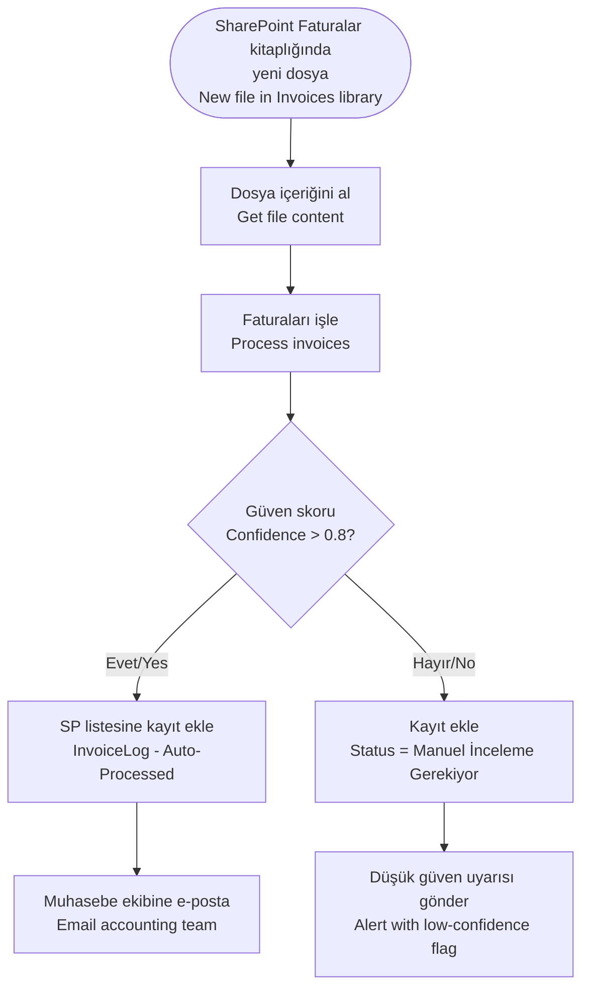
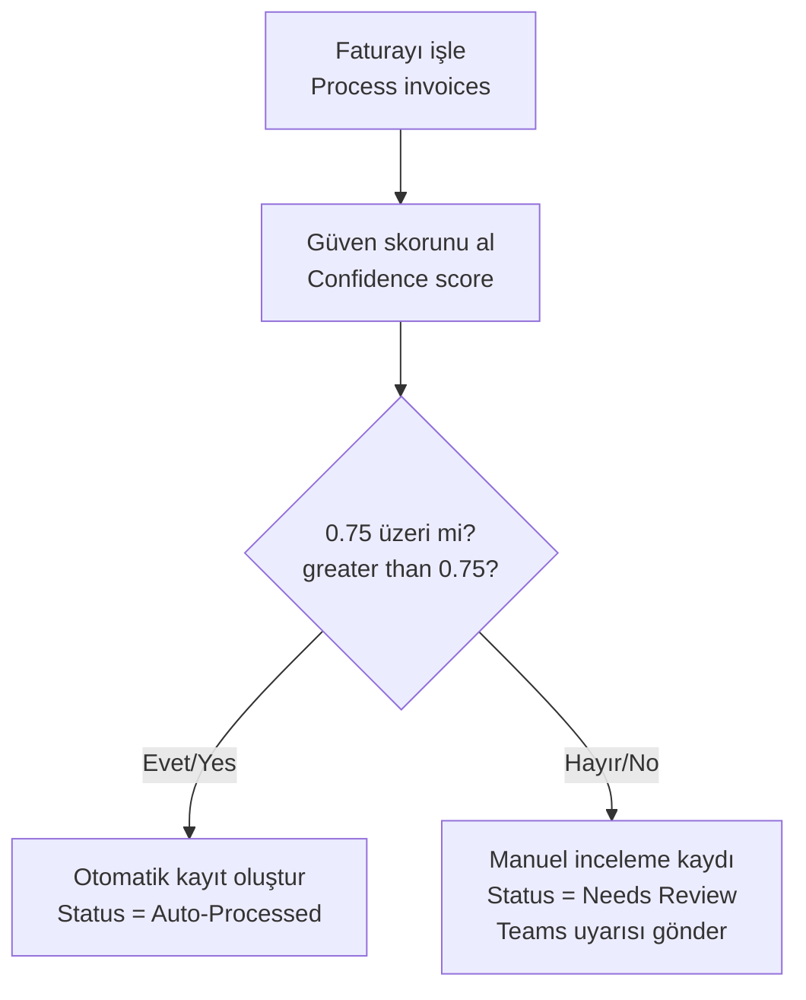
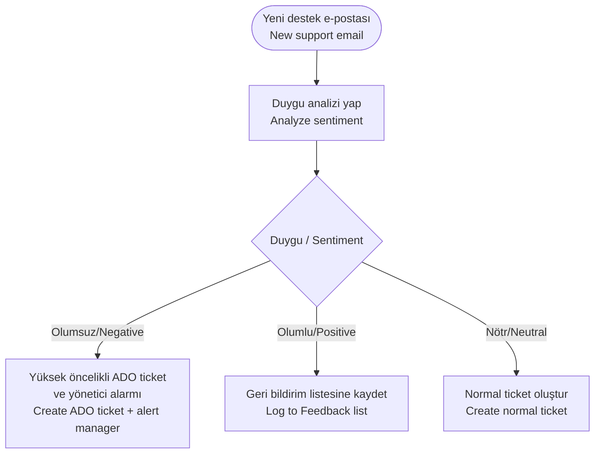

# AI Builder Connector

<span class="badge badge-purple">Premium</span> <span class="badge badge-blue">AI / ML</span>

## Bu Bağlayıcı Nedir? / What is This Connector?

**TR:** AI Builder, Microsoft'un yapay zeka yeteneklerini doğrudan Power Automate akışlarınıza taşır — veri bilimi veya kodlama bilgisi gerekmez. Belge okuma (fatura, makbuz, kimlik), metin analizi (duygu analizi, dil algılama, çeviri), GPT tabanlı içerik üretimi ve özel tahmin modelleri bu bağlayıcı üzerinden kullanılabilir. Kısacası: akışınızın "anlayabilir", "okuyabilir" ve "düşünebilir" hale gelmesini sağlar.

**EN:** AI Builder brings Microsoft's machine-learning capabilities directly into your flows — no data science or coding skills required. Use it to read documents (invoices, receipts, IDs), analyze text (sentiment, language detection, translation), run GPT prompts, and make predictions with custom-trained models. It turns your flow from a simple "if-this-then-that" into something that can actually understand and interpret information.

> 💡 **TR:** AI Builder, **Power Apps / Power Automate Premium** lisansı veya AI Builder eklenti kredisi gerektirir. "Preview" olarak işaretlenen eylemler değişebilir. / **EN:** AI Builder requires a **Power Apps / Power Automate Premium** license (or AI Builder add-on credits). Preview actions are subject to change.

---

## Ne Zaman Kullanılır? / When Would You Use It?

**TR — Tipik senaryolar:**
- E-posta ile gelen fatura PDF'ini otomatik oku: satıcı adı, toplam tutar, vade tarihi çıkar
- Müşteri yorumlarını analiz et, olumsuz yorumu otomatik olarak yöneticiye ilet
- Gelen destek e-postasını GPT ile özetle ve kategorilendir
- Kartvizit fotoğrafını tara, ilgili kişiyi Dataverse'e otomatik ekle
- Türkçe gelen mesajı İngilizceye çevir, İngilizce akışında işle

**EN — Typical scenarios:**
- Invoice PDF arrives via email → auto-extract vendor name, total, due date, line items
- Customer review comes in → negative sentiment → auto-escalate to manager
- Support email arrives → GPT summarizes it and categorizes by type
- Business card photo taken → auto-create Contact in Dataverse
- Turkish message arrives → auto-translate to English → process in English flow

---

## Nasıl Başlanır? / How to Start (First Steps)

**TR — En kolay başlangıç (duygu analizi):**
1. Akışa `Analyze sentiment` eylemini ekleyin
2. **Language:** `tr` (Türkçe) veya `en` (İngilizce) seçin
3. **Text:** Analiz etmek istediğiniz metni girin (ör. e-posta gövdesi)
4. Çıktı: `positive`, `negative`, `neutral` veya `mixed`
5. Sonuca göre koşul ekleyin: olumsuzsa yöneticiye bildirim gönder

**EN — Easiest start (sentiment analysis):**
1. Add `Analyze sentiment` action to your flow
2. **Language:** `en` (English) or `tr` (Turkish)
3. **Text:** Enter the text to analyze (e.g. email body)
4. Output: `positive`, `negative`, `neutral`, or `mixed`
5. Add a condition: if negative → notify manager

---

## All Actions / Tüm Eylemler

### Belge ve Görüntü / Document & Image Intelligence

| Eylem / Action | Açıklama / Description | GA / Önizleme |
|----------------|------------------------|--------------|
| `Process documents` | Özel eğitilmiş form modelinden alan çıkar / Extract fields from custom form models | ✅ GA |
| `Process invoices` | Fatura PDF'inden satıcı, tutar, tarih, satır kalemleri oku / Auto-read invoice fields | ✅ GA |
| `Process receipts` | Makbuz görüntüsünden toplam, ürün, satıcı oku / Read totals, items, merchant | ✅ GA |
| `Process identity document` | Pasaport ve kimlik kartı alanlarını çıkar / Extract fields from IDs | ✅ GA |
| `Recognize text in image or document` | OCR — görüntü veya PDF'den tüm metni çıkar / Extract all text | ✅ GA |
| `Describe images` | Görüntünün doğal dil açıklamasını üret / Natural-language image description | 🔬 Önizleme |
| `Detect objects in images` | Görüntüdeki nesneleri algıla ve etiketle / Locate and label objects | ✅ GA |
| `Analyze Business Card` | Kartvizitteki ad, şirket, e-posta, telefon bilgilerini çıkar / Parse business card | ✅ GA |

### Metin ve Dil / Language & Text

| Eylem / Action | Açıklama / Description | GA / Önizleme |
|----------------|------------------------|--------------|
| `Run a prompt` | GPT modeline metin prompt'u gönder, yanıt al / Send text prompt to GPT model | ✅ GA |
| `Analyze sentiment` | Metni Pozitif / Negatif / Nötr / Karışık olarak sınıflandır / Classify text sentiment | ✅ GA |
| `Detect language` | Metnin dilini tanı / Identify the language of a text string | ✅ GA |
| `Translate text` | 100+ dil arasında çeviri / Translate text between 100+ languages | ✅ GA |
| `Generate key phrases` | Metinden anahtar ifadeleri çıkar / Extract key phrases | ✅ GA |
| `Extract standard entities` | Kişi, Konum, Tarih, Kuruluş gibi varlıkları tanı / Recognize Person, Location, Date, Org | ✅ GA |
| `Extract custom entities` | Kendi özel varlık türlerinizi tanı / Recognize custom-defined entity types | ✅ GA |
| `Classify into custom categories` | Kendi eğittiğiniz model ile metin sınıflandır / Classify with custom trained model | ✅ GA |

### Tahmin / Prediction

| Eylem / Action | Açıklama / Description | GA / Önizleme |
|----------------|------------------------|--------------|
| `Predict` | Eğitilmiş AI Builder tahmin modeli çalıştır / Run a trained prediction model | ✅ GA |
| `Predict by field` | Dataverse sütununa göre tahmin et / Predict based on Dataverse field | ✅ GA |
| `Predict by record ID` | Dataverse kayıt ID ile tahmin et / Predict using a Dataverse record ID | ✅ GA |

---

## Run a Prompt — Akışınıza GPT Ekleyin / GPT in Your Flow

**TR:** `Run a prompt`, en güçlü eylemdir — akışınızda bir büyük dil modelini (LLM/GPT) istediğiniz yerde kullanmanızı sağlar.

**EN:** `Run a prompt` is the most powerful action — use a large language model anywhere in your flow.

### Destek talebi sınıflandırma / Classify a support ticket

```
Eylem / Action: Run a prompt
Prompt:
Analyze this support message and respond in JSON only:
{
  "intent": "complaint|inquiry|praise|other",
  "priority": "high|medium|low",
  "summary": "one sentence",
  "suggestedAction": "string"
}

Message: @{triggerBody()?['body/content']}
```

Sonra **`Parse JSON`** ile yanıtı ayrıştırın / Then use **`Parse JSON`** on the response body.

### Çeviri / Translation

```
Eylem / Action: Run a prompt
Prompt: Translate the following text to English.
Return only the translated text, nothing else.

Text: @{triggerBody()?['description']}
```

### İçerik üretimi / Content generation

```
Eylem / Action: Run a prompt
Prompt:
Write a professional email declining a meeting request.
- Requester name: @{triggerBody()?['name']}
- Meeting topic: @{triggerBody()?['topic']}
- Suggested alternative: next week
Keep it under 100 words.
```

> ⚠️ **TR:** Çıktıyı ayrıştırmayı planlıyorsanız prompt'a "Yalnızca JSON olarak yanıt ver" diye belirtin — aksi halde model formatı değiştirebilir. / **EN:** Always instruct the model to return **JSON only** when you plan to parse the output.

---

## Process Invoices — Fatura İşleme Örneği



**TR:** Process invoices çıktı alanları / **EN:** Output fields:

| Alan / Field | Açıklama / Description |
|--------------|------------------------|
| `VendorName` | Tedarikçi adı / Supplier company name |
| `InvoiceId` | Fatura numarası / Invoice number |
| `InvoiceDate` | Fatura tarihi / Invoice date |
| `DueDate` | Ödeme vadesi / Payment due date |
| `InvoiceTotal` | Toplam tutar / Total amount due |
| `Items` | Satır kalemleri dizisi / Array of line items |
| `Confidence` | Model güven skoru (0–1) / Model confidence |

```
body('Process_invoices')?['vendorName']
body('Process_invoices')?['invoiceTotal']?['amount']
body('Process_invoices')?['confidence']
```

---

## Confidence Score Pattern / Güven Skoru Deseni

**TR:** Modelin çıktısına güvenmeden önce her zaman güven skorunu kontrol edin — düşük skor = insan incelemesi gerekir.



```
Koşul ifadesi / Condition expression:
@{greaterOrEquals(body('Process_invoices')?['confidence'], 0.75)}
```

---

## Sentiment Analysis — Duygu Analizi ve Eskalasyon



```
body('Analyze_sentiment')?['sentiment']
→ "positive" | "negative" | "neutral" | "mixed"

body('Analyze_sentiment')?['confidenceScores']?['positive']
body('Analyze_sentiment')?['confidenceScores']?['negative']
```

---

## Entity Extraction / Varlık Çıkarma

**TR:** Metinden otomatik kişi adı, tarih, konum, tutar gibi bilgileri çıkarın:

```
Eylem / Action: Extract standard entities
Language: tr  (veya / or en)
Text: @{triggerBody()?['body']}

Döner / Returns:
  entities:
    - text: "Ahmet Yılmaz"  category: "Person"
    - text: "yarın"         category: "DateTime"
    - text: "İstanbul"      category: "Location"
    - text: "₺500"          category: "Quantity"
```

**Belirli türleri filtrele / Filter specific entity types:**
```
Filter array:
  From:      @{body('Extract_standard_entities')?['entities']}
  Condition: @{equals(item()?['category'], 'Person')}
```

---

## Translate Text — Çok Dilli Destek Botu

```
1. Eylem / Action: Detect language
   Text: @{triggerBody()?['message']}
   → body('Detect_language')?['language']  →  "tr", "de", "fr" …

2. Eylem / Action: Translate text (İngilizce değilse / only if not English)
   Koşul / Condition: detectedLanguage not equals "en"
   Text:            @{triggerBody()?['message']}
   Source language: @{body('Detect_language')?['language']}
   Target language: en
   → body('Translate_text')?['text']

3. İngilizce metni işle, yanıtı orijinal dile geri çevir
   Process English text, translate response back to original language
```

---

## Common Mistakes / Sık Yapılan Hatalar

| Hata / Mistake | Çözüm / Fix |
|----------------|-------------|
| `Run a prompt` tutarsız JSON döndürüyor | Prompt'a "Sadece geçerli JSON döndür, açıklama ekleme" ekleyin / Add "Return ONLY valid JSON, no explanation" |
| `Process invoices` boş alan döndürüyor | PDF'in gömülü metin içerdiğinden emin olun — taranmış görüntüyse önce `Recognize text` kullanın / Ensure PDF has embedded text |
| Güven skoru kontrol edilmiyor | Her zaman güven bazlı dallanma ekleyin — sadece 0.8 üzerinde otomatik işlem / Always branch on confidence |
| Üretim ortamında Preview eylem kullanılıyor | Kritik akışlar için yalnızca GA eylemlerini kullanın / Use GA-only actions for critical flows |
| AI Builder kredisi tükendi | Power Platform admin center → AI Builder → Credits bölümünden takip edin / Monitor usage in admin center |

---

## Pro Tips / İpuçları

- **`Run a prompt` + yapılandırılmış JSON çıktısı** → tek adımda sınıflandırma, özetleme, çıkarma, üretme / Fastest way to add AI to any flow.
- **Güven skoru kalite kapısı** olarak kullanın: yüksek → otomatik işle, düşük → insan inceleme kuyruğu / Use confidence as a quality gate.
- **`Recognize text` + ifadeler** ile eğitilmiş model olmadan bile taranmış belgelerden veri çıkarın / Extract from scanned docs without a trained model.
- **Toplu belge işlemede** `Apply to each` eşzamanlılığını 1 olarak ayarlayın — AI Builder dakika başına API limiti vardır / Set `Apply to each` concurrency to 1 for bulk document processing.
- **`Detect language`** + **`Translate text`** + **`Run a prompt`** → tam çok dilli akıllı asistan / Combine for a fully multilingual intelligent assistant.
