# AI Builder Connector

<span class="badge badge-purple">Premium</span> <span class="badge badge-blue">AI / ML</span>

AI Builder brings Microsoft's machine-learning capabilities directly into your flows — no data science skills required. It covers document intelligence, language understanding, image analysis, and predictive models.

> 💡 AI Builder requires a **Power Apps / Power Automate Premium** license (or AI Builder add-on credits). Preview actions are subject to change.

---

## All Actions (from the screenshot)

### 📄 Document & Image Intelligence

| Action | Description | GA / Preview |
|--------|-------------|-------------|
| `Process documents` | Extract fields from custom-trained form models | ✅ GA |
| `Process invoices` | Auto-read vendor, total, date, line items from invoice PDFs | ✅ GA |
| `Process receipts` | Read totals, items, merchant from receipt images | ✅ GA |
| `Process identity document` | Extract fields from passports and national ID cards | ✅ GA |
| `Recognize text in image or document` | OCR — extract all text from any image or PDF | ✅ GA |
| `Describe images` | Generate a natural-language description of an image | 🔬 Preview |
| `Detect objects in images` | Locate and label objects in an image with bounding boxes | ✅ GA |
| `Extract information from Co...` | Pull structured data from complex documents (contracts) | 🔬 Preview |
| `Extract information from he...` | Extract fields from healthcare forms/documents | 🔬 Preview |
| `Analyze Business Card` | Parse name, title, company, phone, email from a business card | ✅ GA |
| `Save to AI Builder feed` | Feed data back to retrain a model | 🔬 Preview |

### 💬 Language & Text

| Action | Description | GA / Preview |
|--------|-------------|-------------|
| `Run a prompt` | Send a text prompt to a GPT model and get a response | ✅ GA |
| `Analyze sentiment` | Classify text as Positive / Negative / Neutral / Mixed | ✅ GA |
| `Detect language` | Identify the language of a text string | ✅ GA |
| `Translate text` | Translate text between 100+ languages | ✅ GA |
| `Generate key phrases` | Extract key phrases and important terms from text | ✅ GA |
| `Extract standard entities` | Recognize Person, Location, Date, Organization in text | ✅ GA |
| `Extract custom entities` | Recognize your own custom-defined entity types | ✅ GA |
| `Classify into custom categories` | Classify text using your own trained classification model | ✅ GA |
| `Classify into standard categories` | Classify text using Microsoft's pre-built categories | 🔬 Preview |

### 🤖 Prediction

| Action | Description | GA / Preview |
|--------|-------------|-------------|
| `Predict` | Run a trained AI Builder prediction model | ✅ GA |
| `Predict by field` | Predict based on a Dataverse record field | ✅ GA |
| `Predict by record ID` | Predict using a Dataverse record ID | ✅ GA |

---

## Run a Prompt — GPT in Your Flow

`Run a prompt` is the most powerful action — it lets you use a large language model anywhere in your flow.

### Basic example — classify a support ticket

```
Action: Run a prompt
Prompt:
Analyze this support message and respond in JSON only:
{
  "intent": "complaint|inquiry|praise|other",
  "priority": "high|medium|low",
  "summary": "one sentence",
  "suggestedAction": "string"
}

Message: @{triggerBody()?['body/content']}
```

Then use **`Parse JSON`** on the response body.

### Translation example

```
Action: Run a prompt
Prompt: Translate the following text to English. Return only the translated text, nothing else.

Text: @{triggerBody()?['description']}
```

### Content generation

```
Action: Run a prompt
Prompt:
Write a professional email declining a meeting request.
- Requester name: @{triggerBody()?['name']}
- Meeting topic: @{triggerBody()?['topic']}
- Suggested alternative: next week
Keep it under 100 words.
```

> ⚠️ Always instruct the model to return **JSON only** when you plan to parse the output. Natural language responses can vary in structure.

---

## Process Invoices — Full Example

```mermaid
flowchart TD
    T([📁 New file in SharePoint\nInvoices library]) --> GFC[Get file content]
    GFC --> PI[Process invoices\nFile = file content]
    PI --> COND{Confidence\n> 0.8?}
    COND -->|Yes| CREATE[Create SP list item\nInvoiceLog]
    COND -->|No| REVIEW[Create item:\nStatus = Needs Review]
    CREATE --> EMAIL[Email accounting team]
    REVIEW --> ALERT[Email with low-confidence flag]
```



**Process invoices output fields:**

| Field | Description |
|-------|-------------|
| `VendorName` | Supplier company name |
| `VendorAddress` | Supplier address |
| `InvoiceId` | Invoice number |
| `InvoiceDate` | Invoice date |
| `DueDate` | Payment due date |
| `SubTotal` | Amount before tax |
| `TotalTax` | Tax amount |
| `InvoiceTotal` | Total amount due |
| `Items` | Array of line items |
| `Items/Description` | Line item description |
| `Items/Quantity` | Line item quantity |
| `Items/UnitPrice` | Line item unit price |
| `Items/Amount` | Line item total |
| `Confidence` | Model confidence (0–1) |

Access fields:
```
body('Process_invoices')?['vendorName']
body('Process_invoices')?['invoiceTotal']?['amount']
body('Process_invoices')?['confidence']
```

---

## Confidence Score Pattern

Always validate the model's confidence before trusting its output:

```mermaid
flowchart TD
    PI[Process invoices] --> COMP[Compose: confidence\nbody Process_invoices confidence]
    COMP --> COND{confidence\ngreater than 0.75?}
    COND -->|Yes ✅| AUTO[Auto-create invoice record\nStatus = Auto-Processed]
    COND -->|No ⚠️| MANUAL[Create record\nStatus = Needs Manual Review\nPost Teams alert to AP team]
```



```
Condition expression:
@{greaterOrEquals(body('Process_invoices')?['confidence'], 0.75)}
```

---

## Sentiment Analysis — Escalation Flow

```mermaid
flowchart TD
    T([📧 New support email]) --> SENT[Analyze sentiment]
    SENT --> SW{Sentiment}
    SW -->|Negative| ESCAL[Create high-priority\nADO ticket + alert manager]
    SW -->|Positive| LOG[Log to Feedback list\nno action needed]
    SW -->|Neutral| TICKET[Create normal ticket]
```



```
body('Analyze_sentiment')?['sentiment']
→ "positive" | "negative" | "neutral" | "mixed"

body('Analyze_sentiment')?['confidenceScores']?['positive']
body('Analyze_sentiment')?['confidenceScores']?['negative']
```

---

## Entity Extraction — Auto-tag Support Tickets

```
Action: Extract standard entities
Language: English
Text:     @{triggerBody()?['body']}

Returns:
  entities:
    - text: "John Smith"   category: "Person"
    - text: "tomorrow"     category: "DateTime"
    - text: "London"       category: "Location"
    - text: "$500"         category: "Quantity"
```

Use with **`Filter array`** to get only entities of a certain type:
```
Filter array:
  From:      @{body('Extract_standard_entities')?['entities']}
  Condition: @{equals(item()?['category'], 'Person')}
```

---

## Translate Text — Multilingual Support Bot

```
Action: Detect language
Text: @{triggerBody()?['message']}
→ body('Detect_language')?['language']   →  "tr", "de", "fr" …

Action: Translate text (only if not English)
Condition: not equals detectedLanguage to "en"
  Text:            @{triggerBody()?['message']}
  Source language: @{body('Detect_language')?['language']}
  Target language: en
  → body('Translate_text')?['text']

Then process the English text, translate the response back to the original language.
```

---

## Business Card Scanner

```
Action: Analyze Business Card
Image: @{triggerBody()?['fileContent']}   ← base64 image

Output fields:
  CleanedEmail      → body(...)?['cleanedEmail']
  CompanyName       → body(...)?['companyName']
  Department        → body(...)?['department']
  Fax               → body(...)?['fax']
  FirstName         → body(...)?['firstName']
  LastName          → body(...)?['lastName']
  MobilePhone       → body(...)?['mobilePhone']
  Title             → body(...)?['title']
  Website           → body(...)?['website']
```

Combine with **Dataverse `Upsert a row`** to auto-create a Contact record.

---

## Common Mistakes

| Mistake | Fix |
|---------|-----|
| `Run a prompt` returns inconsistent JSON | Add "Return ONLY valid JSON, no explanation" to the prompt |
| `Process invoices` returns empty fields | Ensure the PDF has embedded text (not just a scanned image) or use `Recognize text` first |
| Confidence score not checked | Always branch on confidence — auto-process only above 0.8 |
| Using Preview actions in production | They can change or be removed; use GA-only actions for critical flows |
| AI Builder credits exhausted | Monitor usage in Power Platform admin center → AI Builder → Credits |
| Predict model returns wrong results | Retrain with more examples; check model's training evaluation |

---

## Pro Tips

- **`Run a prompt` + structured JSON output** is the fastest way to add AI intelligence to any flow — classify, summarize, extract, generate, all in one step.
- Use **confidence scores** as a quality gate: high confidence → auto-process, low confidence → human review queue.
- **`Recognize text` → expressions** lets you extract structured data from scanned documents even without a trained model — use `indexOf()` + `substring()` on the OCR output.
- For **bulk document processing** (`Process invoices` in a loop), set **`Apply to each` concurrency to 1** — AI Builder has per-minute API limits.
- **Model versioning**: before updating an AI Builder model, test the new version in a dev environment — output schema changes can break downstream `Parse JSON` actions.
- Combine **`Detect language`** + **`Translate text`** + **`Run a prompt`** for a fully multilingual intelligent assistant.
