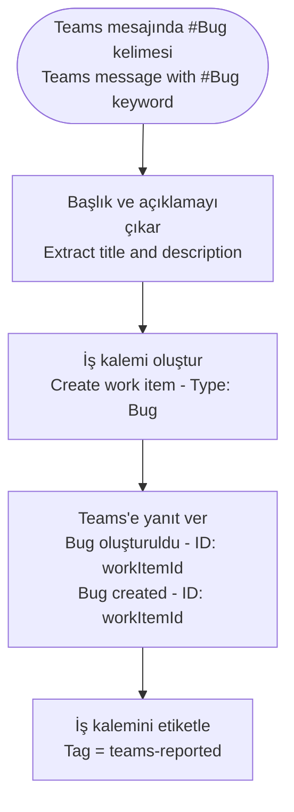

# Azure DevOps Connector

<span class="badge badge-green">Standard</span>

## Bu Bağlayıcı Nedir? / What is This Connector?

**TR:** Azure DevOps, yazılım geliştirme ekiplerinin iş takibi (backlog, bug, görev), kaynak kod yönetimi (Git), CI/CD pipeline'ları ve test süreçlerini yönettikleri Microsoft platformudur. Bu bağlayıcı ile Power Automate, geliştirme döngüsüne doğrudan bağlanabilir: bir Teams mesajından otomatik bug oluşturabilir, bir SharePoint onay formundan iş kalemi açabilir, bir pipeline tetikleyebilir veya iş kaleminin durumunu güncelleyebilir.

**EN:** Azure DevOps is where software teams manage their work items (backlogs, bugs, tasks), source code (Git repos), CI/CD pipelines, and test plans. This connector lets Power Automate integrate with the development cycle — auto-create bugs from Teams messages, trigger pipelines from approval flows, update work item states, or sync data between project management tools and DevOps.

---

## Ne Zaman Kullanılır? / When Would You Use It?

**TR — Tipik senaryolar:**
- Müşteri destek e-postası geldiğinde otomatik ADO'da Bug kaydı oluştur
- Teams'deki "#bug" içeren mesajı algıla, otomatik iş kalemi aç ve kanala "Bug #123 oluşturuldu" yaz
- SharePoint'teki onay formu onaylandığında ilgili geliştirme sprint'ine User Story ekle
- Bir form doldurulduğunda belirli bir CI/CD pipeline'ını otomatik tetikle
- Kritik hatalar için ADO iş kalemini oluştur ve yöneticiye Teams bildirimi gönder

**EN — Typical scenarios:**
- Customer support email arrives → auto-create a Bug work item in ADO
- Teams message with "#bug" keyword → create work item, post "Bug #123 created" back to channel
- SharePoint approval form approved → add a User Story to the sprint
- Form submitted → trigger a specific build pipeline automatically
- Critical error detected → create ADO work item + alert manager in Teams

---

## Nasıl Başlanır? / How to Start (First Steps)

**TR:**
1. Akışa `Create a work item` eylemini ekleyin
2. **Organization name:** Azure DevOps organizasyonunuzun adını girin (URL'deki `dev.azure.com/ORG_ADI` kısmı)
3. **Project name:** Projeyi seçin
4. **Work item type:** Bug, Task, User Story vb. seçin
5. **Title:** İş kaleminin başlığını girin (dinamik içerik kullanabilirsiniz)
6. Kaydet ve test edin — ADO'da iş kalemi oluştuğunu doğrulayın

**EN:**
1. Add `Create a work item` action to your flow
2. **Organization name:** Enter your ADO org name (the part after `dev.azure.com/`)
3. **Project name:** Pick your project
4. **Work item type:** Bug, Task, User Story, etc.
5. **Title:** Enter a title — use dynamic content from the trigger
6. Save and test — verify the work item appears in ADO

---

## Key Actions / Temel Eylemler

| Eylem / Action | Açıklama / Description |
|----------------|------------------------|
| `Create a work item` | Yeni bug, görev, user story vb. oluştur / Add a new bug, task, user story, etc. |
| `Update a work item` | Mevcut iş kaleminin alanlarını değiştir / Change fields on an existing item |
| `Get work item details` | ID ile iş kalemi oku / Read a work item by ID |
| `Get work item children` | Hiyerarşideki alt kalemleri çek / Fetch child items in a hierarchy |
| `Get query results` | Kayıtlı WIQL sorgusu çalıştır / Run a saved WIQL query |
| `Queue a new build` | CI pipeline'ı tetikle / Trigger a CI pipeline |
| `Create a new release` | CD release oluştur / Trigger a CD release |
| `List pipelines` | Pipeline'ları listele / Enumerate pipelines |
| `List projects` | ADO projelerini listele / Enumerate ADO projects |
| `List Git repositories` | Projedeki repo'ları listele / List repos in a project |
| `Send an HTTP request to Azure DevOps` | Tam REST API erişimi / Full REST API access |

---

## Create a Work Item / İş Kalemi Oluşturma

```json
Eylem / Action: Create a work item
Organization name: my-org
Project name: MyProject
Work item type: Bug
Title: @{triggerBody()?['subject']}
Description: @{triggerBody()?['body']}
Priority: 2
Tags: automated; power-automate
```

---

## Update a Work Item — Change State / Durum Güncelleme

```json
Eylem / Action: Update a work item
Organization name: my-org
Project name: MyProject
Id: @{variables('workItemId')}
Fields:
  System.State:                    Active
  System.AssignedTo:               developer@company.com
  Microsoft.VSTS.Common.Priority:  1
```

> 💡 **TR:** İş kalemi alan adları **referans adları** kullanır (ör. `System.Title`, `System.State`). ADO → Proje Ayarları → Süreç → Alanlar bölümünden bulabilirsiniz. / **EN:** Work item field names use their **reference names** (e.g., `System.Title`). Find them in ADO → Project Settings → Process → Fields.

---

## Queue a Build / Pipeline Tetikleme

```json
Eylem / Action: Queue a new build
Organization name: my-org
Project name: MyProject
Build definition id: 42
Source branch: refs/heads/main
Parameters:
{
  "environment": "staging",
  "version": "@{variables('releaseVersion')}"
}
```

---

## Advanced: Send HTTP Request to Azure DevOps / Gelişmiş HTTP İsteği

**TR:** Standart eylemlerle yapılamayan işlemler (çoklu alan güncellemesi, test koşusu oluşturma, ADO REST API v7) için:

```http
Method: PATCH
Uri: https://dev.azure.com/{org}/{project}/_apis/wit/workitems/{id}?api-version=7.1
Headers:
  Content-Type: application/json-patch+json
Body:
[
  { "op": "add", "path": "/fields/System.State",   "value": "Closed" },
  { "op": "add", "path": "/fields/System.Tags",    "value": "resolved; automated" },
  { "op": "add", "path": "/fields/System.History", "value": "Power Automate tarafından otomatik kapatıldı / Closed automatically by Power Automate" }
]
```

---

## Real-World Example / Gerçek Örnek: Teams → ADO İş Kalemi



---

## Common Mistakes / Sık Yapılan Hatalar

| Hata / Mistake | Çözüm / Fix |
|----------------|-------------|
| Yanlış alan referans adı / Wrong field reference name | ADO → Süreç → Alanlar bölümünden referans adını bulun / Find in ADO → Process → Fields |
| Pipeline ID yerine adı girildi / Build definition ID | Pipeline URL'sindeki numerik ID'yi kullanın / Use numeric ID from pipeline URL |
| API sürüm uyumsuzluğu / API version mismatch | En son özellikler için `api-version=7.1` kullanın / Use `api-version=7.1` for latest features |
| Organizasyon adı yanlış / Organization name format | Tam URL değil, sadece org adı girin (https:// olmadan) / Use org name only, not full URL |

---

## Pro Tips / İpuçları

- **`Get query results`** ile ADO'daki kayıtlı **Shared Query**'yi kullanın — akış içine WIQL yazmaktan kaçınırsınız / Use saved Shared Queries instead of writing WIQL in the flow.
- **`Queue a new build`** → sonucu planlanmış kontrol + `Get build status` ile izleyin / Chain build trigger with status check pattern.
- **`Send HTTP request`** ile JSON Patch formatını (`application/json-patch+json`) kullanarak tek API çağrısında çoklu alan güncelleyin / Use JSON Patch for bulk field updates in one API call.
