# Azure DevOps Connector

<span class="badge badge-green">Standard</span>

Integrate Power Automate with Azure DevOps to automate work item management, pipelines, releases, and code repositories.

---

## Key Actions

| Action | Description |
|--------|-------------|
| `Create a work item` | Add a new bug, task, user story, etc. |
| `Update a work item` | Change fields on an existing item |
| `Get work item details` | Read a work item by ID |
| `Get work item children` | Fetch child items in a hierarchy |
| `Get query results` | Run a saved WIQL query |
| `Queue a new build` | Trigger a CI pipeline |
| `Create a new release` | Trigger a CD release |
| `List pipelines` | Enumerate pipelines |
| `List projects` | Enumerate ADO projects |
| `List Git repositories` | List repos in a project |
| `Send an HTTP request to Azure DevOps` | Full REST API access |

---

## Create a Work Item

```json
Action: Create a work item
Organization name: my-org
Project name: MyProject
Work item type: Bug
Title: @{triggerBody()?['subject']}
Description: @{triggerBody()?['body']}
Priority: 2
Tags: automated; power-automate
```

---

## Update a Work Item — Change State

```json
Action: Update a work item
Organization name: my-org
Project name: MyProject
Id: @{variables('workItemId')}
Fields:
  System.State: Active
  System.AssignedTo: developer@company.com
  Microsoft.VSTS.Common.Priority: 1
```

> 💡 Work item field names use their **reference names** (e.g., `System.Title`, not `Title`). Find them in ADO → Project Settings → Process → Fields.

---

## Queue a Build (Trigger CI)

```json
Action: Queue a new build
Organization name: my-org
Project name: MyProject
Build definition id: 42
Source branch: refs/heads/main
Parameters:
{
  "environment": "staging",
  "version": "@{variables('releaseVersion')}"
}
```

---

## Advanced: Send HTTP Request to Azure DevOps

For operations not covered by standard actions — for example, updating multiple fields, creating test runs, or accessing ADO REST API v7.

```http
Method: PATCH
Uri: https://dev.azure.com/{org}/{project}/_apis/wit/workitems/{id}?api-version=7.1
Headers:
  Content-Type: application/json-patch+json
Body:
[
  { "op": "add", "path": "/fields/System.State",    "value": "Closed" },
  { "op": "add", "path": "/fields/System.Tags",     "value": "resolved; automated" },
  { "op": "add", "path": "/fields/System.History",  "value": "Closed automatically by Power Automate" }
]
```

---

## Real-World Example: Teams Message → ADO Work Item

```mermaid
flowchart TD
    T([💬 Teams message with @Bug keyword]) --> PARSE[Extract title\nand description from message]
    PARSE --> CREATE[Create work item\nType: Bug]
    CREATE --> REPLY[Reply in Teams:\n✅ Bug created - ID: workItemId]
    REPLY --> TAG[Update work item:\nTag = teams-reported]
```



---

## Common Mistakes

| Mistake | Fix |
|---------|-----|
| Wrong field reference name | Use ADO → Process → Fields to find reference names |
| Build definition ID instead of name | Use the numeric ID from the pipeline URL |
| API version mismatch | Use `api-version=7.1` for latest features |
| Organization name format | Use the org name, not the full URL (no `https://`) |

---

## Pro Tips

- Use **`Get query results`** with a saved **Shared Query** in ADO to avoid writing WIQL in the flow.
- Chain **`Queue a new build`** → wait for result using a scheduled check + `Get build status` pattern.
- Use **`Send HTTP request`** with JSON Patch format (`application/json-patch+json`) for bulk field updates in one API call.
