# Microsoft Dataverse Connector

<span class="badge badge-purple">Premium</span>

## Bu Bağlayıcı Nedir? / What is This Connector?

**TR:** Microsoft Dataverse, Microsoft'un kendi bulut veritabanıdır ve tüm Dynamics 365 uygulamalarının (CRM, ERP, Müşteri Hizmetleri vb.) ve model tabanlı Power Apps'in altında çalışır. Verileri tablolar halinde saklar — SQL'e benzer ama doğrudan Microsoft 365 ekosistemine entegredir ve kodlama gerektirmez. Satış kayıtları, müşteri verileri, fırsatlar, iş süreçleri burada yaşar. Bu bağlayıcı ile Power Automate bu veritabanında otomatik olarak kayıt oluşturabilir, okuyabilir, güncelleyebilir ve silebilir.

**EN:** Microsoft Dataverse is Microsoft's cloud database — it powers all Dynamics 365 apps (CRM, Customer Service, ERP etc.) and model-driven Power Apps. Think of it as a smart database built into the Microsoft 365 ecosystem: it stores contacts, sales records, opportunities, custom business data, and more. This connector gives Power Automate full read/write access to all of that — no SQL knowledge needed.

---

## Ne Zaman Kullanılır? / When Would You Use It?

**TR — Tipik senaryolar:**
- SharePoint onay formu onaylandığında otomatik Dynamics 365'te müşteri kaydı oluştur
- Teams üzerinden gelen talep formunu Dataverse'deki özel tabloya kaydet
- Her gece Dataverse'deki açık fırsatları kontrol et, süresi dolanlara yöneticiye bildirim gönder
- Excel/CSV'deki müşteri listesini toplu olarak Dataverse'e aktar
- Yeni bir Dataverse kaydı oluştuğunda ilgili kişiye otomatik e-posta gönder

**EN — Typical scenarios:**
- SharePoint approval form approved → auto-create a Contact or Account in Dynamics 365
- Teams form submission → save to a custom Dataverse table
- Every night → check open opportunities, alert manager on overdue ones
- Bulk import Excel/CSV customer list into Dataverse
- New Dataverse record created → send automated welcome email

---

## Nasıl Başlanır? / How to Start (First Steps)

**TR:**
1. Akışa `Add a new row` eylemini ekleyin
2. **Environment:** Dataverse ortamınızı seçin (genellikle şirket adınızla aynıdır)
3. **Table name:** Tabloyu seçin (ör. `Contacts`)
4. Alanları doldurun — **Görünen adlar değil, mantıksal adlar** kullanılır (ör. `First Name` yerine `firstname`)
5. Kaydet ve test edin

> 💡 **TR:** Sütunların mantıksal adlarını bulmak için Power Apps Maker portalına gidin → Tablolar → [Tablo] → Sütunlar → İstenen sütuna tıklayın → "Ad" alanını görün. / **EN:** To find column logical names: Power Apps Maker → Tables → [Table] → Columns → click a column → see the "Name" field.

**EN:**
1. Add `Add a new row` action to your flow
2. **Environment:** Select your Dataverse environment
3. **Table name:** Pick the table (e.g. `Contacts`)
4. Fill in the fields using **logical names** (e.g. `firstname`, not `First Name`)
5. Save and test

---

## Core Actions / Temel Eylemler

| Eylem / Action | Açıklama / Description |
|----------------|------------------------|
| `Add a new row` | Yeni kayıt ekle / Insert a record |
| `Get a row by ID` | GUID ile tek kayıt çek / Fetch one record by GUID |
| `List rows` | OData filtresiyle çoklu sorgu / Query multiple records (supports OData filter) |
| `Update a row` | Kaydı güncelle / Modify a record |
| `Delete a row` | Kaydı sil / Remove a record |
| `Upsert a row` | Varsa güncelle, yoksa ekle / Update if exists, insert if not |
| `Perform a bound action` | Kayda bağlı Dataverse eylemi çağır / Call a Dataverse action tied to a row |
| `Perform an unbound action` | Global Dataverse eylemi çağır / Call a global Dataverse action |
| `Upload a file or an image` | Kayda medya ekle / Attach media to a record |
| `Download a file or an image` | Kayıttan medya al / Retrieve media from a record |

> 💡 **TR:** `Add a new row to selected environment` gibi "selected environment" varyantları, farklı bir Dataverse ortamını hedeflemenizi sağlar — çok ortamlı akışlar için kullanışlıdır. / **EN:** "Selected environment" variants let you target a specific Dataverse environment — useful for cross-environment flows.

---

## Table and Column Names / Tablo ve Sütun Adları

**TR:** Dataverse **görünen adlar** değil, **mantıksal adlar** kullanır. Bu ikisi farklıdır:

**EN:** Dataverse uses **logical names** (not display names) — they differ:

| Görünen Ad / Display Name | Mantıksal Ad / Logical Name |
|---------------------------|------------------------------|
| Account / Hesap | `account` |
| Full Name / Tam Ad | `fullname` |
| Primary Email / Birincil E-posta | `emailaddress1` |
| My Custom Table | `cr1a2_mycustomtable` |

**TR:** Mantıksal adları şuradan bulabilirsiniz:
- **Power Apps** → Tablolar → [Tablo] → Sütunlar → Sütun detayı

**EN:** Find logical names in:
- **Power Apps** → Tables → [Table] → Columns → Column details
- **URL** when you open the table in the maker portal

---

## List Rows with OData Filter / Satırları Filtrele

**TR:** `List rows` eylemi ile sunucu tarafında filtre uygulayarak sadece ihtiyacınız olan verileri çekin.

```
# Sadece aktif kayıtlar / Active records only
statecode eq 0

# Bu yıl oluşturulanlar / Created this year
createdon ge 2024-01-01T00:00:00Z

# Özel sütun değeri / Custom column
cr1a2_status eq 'Approved'

# Belirli bir kullanıcıya ait / Owned by specific user
_ownerid_value eq 'USER-GUID-HERE'
```

**İlişkili tabloları genişlet / Expand related tables (lookups):**
```
Expand Query: cr1a2_contactid($select=fullname,emailaddress1)
```

**Performans için belirli sütunları seç / Select specific columns:**
```
Select columns: accountid,name,emailaddress1,createdon
```

---

## Upsert — En Güçlü Desen / The Power Pattern

**TR:** "Kayıt varsa güncelle, yoksa ekle" mantığını tek eylemde halleder. Eskiden 4 adım sürerdi:

**EN:** Instead of this 4-step pattern:
```
1. List rows (to check if exists)
2. Condition (exists?)
3a. If yes → Update a row
3b. If no  → Add a new row
```

**TR:** Artık tek eylem yeterli / Now just one action:
```
Action: Upsert a row
Table name: Contacts
Row ID: [unique identifier or GUID]
Row: { fields to set }
```

---

## Perform a Bound Action / Kayda Bağlı Eylem Çağırma

**TR:** Dynamics 365'teki standart veya özel eylemleri (ör. "Fırsatı Kazan") tetikler:

**EN:** Calls a Dataverse action (like "Win Opportunity") on a specific record:

```json
Table name: opportunities
Row ID: @{triggerBody()?['opportunityid']}
Action name: WinOpportunity
Parameters:
{
  "Status": 3,
  "OpportunityClose": {
    "subject": "Won via automation",
    "opportunityid@odata.bind": "/opportunities/@{triggerBody()?['opportunityid']}"
  }
}
```

---

## Real-World Example / Gerçek Örnek: SharePoint → Dataverse

```mermaid
flowchart TD
    T([SP - Öğe oluşturulduğunda\nWhen SP item is created]) --> GI[SP öğe detaylarını al\nGet SP item details]
    GI --> COND{Durum Onaylı mı?\nStatus = Approved?}
    COND -->|Evet/Yes| UPSERT[Dataverse Contacts'a\nUpsert a row]
    UPSERT --> LOG[AuditLog tablosuna\nyeni satır ekle\nAdd a new row]
    COND -->|Hayır/No| SKIP[Sonlandır\nTerminate - Succeeded]
```



---

## Common Mistakes / Sık Yapılan Hatalar

| Hata / Mistake | Çözüm / Fix |
|----------------|-------------|
| Görünen ad kullanmak / Using display name | Mantıksal adı kullanın / Check logical name in table settings |
| GUID formatı yanlış / GUID format wrong | Küçük harf, süslü parantez yok: `xxxxxxxx-xxxx-xxxx-xxxx-xxxxxxxxxxxx` / Lowercase, no braces |
| Lookup (ilişki) alanı boş / Lookup field not set | `@odata.bind` sözdizimini kullanın: `"cr1a2_contactid@odata.bind": "/contacts/GUID"` |
| List rows boş dönüyor / List rows returns empty | Yanlış ortama bağlı olabilirsiniz / Check environment — may be connected to wrong one |
| Büyük dosya yükleme başarısız | Dosya/görüntü sütunları için max 64 MB / Max row size is 64 MB for file/image columns |

---

## Pro Tips / İpuçları

- Varsa güncelle / yoksa ekle senaryoları için her zaman **`Upsert a row`** kullanın — atomik ve daha hızlı / Always use over check-then-create pattern.
- `List rows` eyleminde **`Select columns`** kullanın — Dynamics tablolarında 100+ sütun olabilir, hepsini çekmek gereksiz / Massive performance difference.
- **`Perform an unbound action`** ile özel Dataverse plugin veya workflow'larını tetikleyin / Trigger custom plugins or workflows.
- Toplu ekleme için **paralel dallar** açın veya Dataverse'ın toplu aktarma özelliğini kullanın / For bulk inserts, use parallel branches or Dataverse bulk import.
