# Microsoft Dataverse Connector

<span class="badge badge-purple">Premium</span>

Dataverse is Microsoft's cloud database — it powers all Dynamics 365 apps and model-driven Power Apps. The Dataverse connector gives Power Automate full CRUD access to its tables.

---

## Core Actions

| Action | Description |
|--------|-------------|
| `Add a new row` | Insert a record |
| `Get a row by ID` | Fetch one record by GUID |
| `List rows` | Query multiple records (supports OData filter) |
| `Update a row` | Modify a record |
| `Delete a row` | Remove a record |
| `Upsert a row` | Update if exists, insert if not |
| `Perform a bound action` | Call a Dataverse action tied to a row |
| `Perform an unbound action` | Call a global Dataverse action |
| `Upload a file or an image` | Attach media to a record |
| `Download a file or an image` | Retrieve media from a record |

> 💡 **Selected environment variants** (e.g., `Add a new row to selected environment`) let you target a specific Dataverse environment — useful for cross-environment flows.

---

## Table and Column Names

Dataverse uses **logical names** (not display names):

| Display Name | Logical Name |
|-------------|-------------|
| Account | account |
| Full Name | fullname |
| Primary Email | emailaddress1 |
| My Custom Table | cr1a2_mycustomtable |

Find logical names in:
- **Power Apps** → Tables → [Table] → Columns → Column details
- **URL** when you open the table in the maker portal

---

## List Rows with OData Filter

```
# Filter examples (use logical column names)
statecode eq 0                           # Active records only
createdon ge 2024-01-01T00:00:00Z        # Created this year
cr1a2_status eq 'Approved'               # Custom column
_ownerid_value eq 'USER-GUID-HERE'       # Owned by specific user
```

**Expand related tables** (lookups/relationships):
```
Expand Query: cr1a2_contactid($select=fullname,emailaddress1)
```

**Select specific columns** (for performance):
```
Select columns: accountid,name,emailaddress1,createdon
```

---

## Upsert — The Power Pattern

Instead of:
```
1. List rows (to check if exists)
2. Condition (exists?)
3a. If yes → Update a row
3b. If no → Add a new row
```

Just use one action:
```
Action: Upsert a row
Table name: Contacts
Row ID: [your unique identifier or GUID]
Row: { fields to set }
```

---

## Perform a Bound Action

Calls a Dataverse custom action or standard action (like "Win Opportunity") on a specific record:

```json
Table name: opportunities
Row ID: @{triggerBody()?['opportunityid']}
Action name: WinOpportunity
Parameters:
{
  "Status": 3,
  "OpportunityClose": {
    "subject": "Won via automation",
    "opportunityid@odata.bind": "/opportunities/@{triggerBody()?['opportunityid']}"
  }
}
```

---

## Real-World Example: Sync Approved Items to Dataverse

```mermaid
flowchart TD
    T([📋 SP: When item is created]) --> GI[Get SP item details]
    GI --> COND{Status = Approved?}
    COND -->|Yes| UPSERT[Upsert a row in Dataverse\nContacts table]
    UPSERT --> LOG[Add a new row to\nAuditLog table]
    COND -->|No| SKIP[Terminate - Succeeded]
```



---

## Common Mistakes

| Mistake | Fix |
|---------|-----|
| Using display name instead of logical name | Check logical name in table settings |
| GUID format wrong | Dataverse GUIDs must be lowercase, no braces: `xxxxxxxx-xxxx-xxxx-xxxx-xxxxxxxxxxxx` |
| Lookup field not set | Use `@odata.bind` syntax: `"cr1a2_contactid@odata.bind": "/contacts/GUID"` |
| List rows returns empty but data exists | Check environment — you may be connected to wrong environment |
| Row too large / file upload fails | Max row size is 64 MB for file/image columns |

---

## Pro Tips

- Always use **`Upsert a row`** over the check-then-create pattern — it's atomic and faster.
- Use **`Select columns`** in `List rows` to avoid fetching all 100+ columns of a Dynamics entity — massive performance difference.
- Use **`Perform an unbound action`** to trigger custom Dataverse plugins or workflows.
- For bulk inserts, consider **Dataverse bulk import** or use parallel branches in the flow to insert multiple rows simultaneously.
