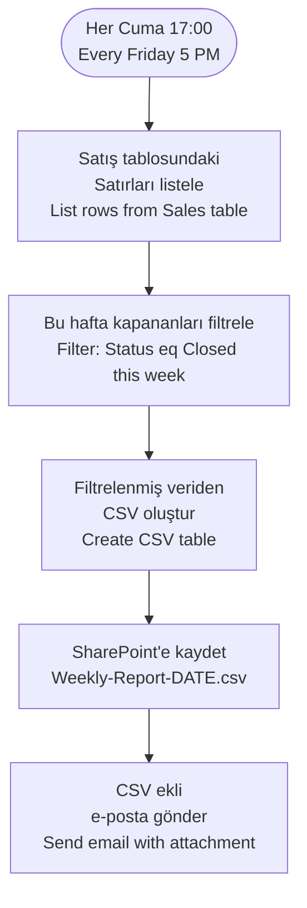

# Excel Online (Business) Connector

<span class="badge badge-green">Standard</span>

## Bu Bağlayıcı Nedir? / What is This Connector?

**TR:** Excel Online (Business) bağlayıcısı, SharePoint veya OneDrive'da saklanan Excel dosyalarını otomatik olarak okuyup yazmayı sağlar. Sisteminize elle veri girmek yerine Power Automate bunu sizin için yapabilir: formdan gelen yanıtı Excel'e ekler, mevcut satırları günceller veya Excel'deki verileri okuyarak rapor oluşturur.

**EN:** This connector lets Power Automate read from and write to Excel workbooks stored in SharePoint or OneDrive. Instead of manually copying data into Excel, your flow can do it automatically — adding rows from form submissions, updating records, or reading data to build reports.

---

## Ne Zaman Kullanılır? / When Would You Use It?

**TR — Tipik senaryolar:**
- Microsoft Forms'tan gelen yanıtları otomatik olarak Excel tablosuna kaydet
- Her gece çalışarak gün içindeki siparişleri bir Excel raporuna ekle
- Excel'deki satırları okuyarak her birine e-posta gönder (toplu bildirim)
- Haftada bir kez Excel'deki verileri CSV'ye aktarıp e-posta ile ilet
- Belirli bir duruma gelen satırları başka bir tabloya taşı

**EN — Typical scenarios:**
- Microsoft Forms submission → automatically add a row to an Excel table
- Nightly job → append the day's orders to an Excel report
- Read Excel rows → send a personalized email to each person (bulk notification)
- Weekly → export filtered Excel data as CSV and email it
- Row reaches a certain status → move it to a different table or sheet

---

## Nasıl Başlanır? / How to Start (First Steps)

**TR:**
1. Excel dosyanızı SharePoint veya OneDrive'a kaydedin
2. Excel'de verilerinizi **Tablo** olarak biçimlendirin (`Ctrl+T` kısayolu)
3. Tabloya bir ad verin (ör. `SatisVerileri`)
4. Akışa `Add a row into a table` eylemini ekleyin
5. Konum seçin (OneDrive veya SharePoint), dosyayı seçin, tablo adını seçin
6. Her sütun için değer girin

**EN:**
1. Save your Excel file to SharePoint or OneDrive
2. Format your data as a **Table** in Excel (`Ctrl+T`)
3. Give the table a name (e.g. `SalesData`)
4. In your flow, add `Add a row into a table`
5. Choose the location (OneDrive or SharePoint), file, and table name
6. Fill in a value for each column

> ⚠️ **TR:** Bağlayıcı yalnızca **adlandırılmış Tablolarla** çalışır — düz hücre aralıklarıyla değil. / **EN:** The connector only works with **named Tables** — not plain cell ranges.

---

## Prerequisites / Gereksinimler

**TR:**
1. Excel dosyası **SharePoint** veya **OneDrive for Business**'ta olmalı (kişisel OneDrive'da değil)
2. Veriler **adlandırılmış Tablo** içinde olmalı (`Ctrl+T` ile oluşturulur)
3. Akış çalışırken dosya başka bir kullanıcı tarafından açık olmamalı

**EN:**
1. File must be in **SharePoint** or **OneDrive for Business** (not personal OneDrive)
2. Data must be in a **named Table** (`Ctrl+T` in Excel to create one)
3. File must not be open/locked by another user when the flow runs

---

## Key Actions / Temel Eylemler

| Eylem / Action | Açıklama / Description |
|----------------|------------------------|
| `List rows present in a table` | Tablodaki tüm satırları oku / Read all rows from a table |
| `Add a row into a table` | Yeni satır ekle / Insert a new row |
| `Update a row` | Mevcut satırı güncelle / Modify an existing row by key column |
| `Delete a row` | Satırı sil / Remove a row by key column |
| `Get a row` | Belirli bir satırı çek / Retrieve one row by key |
| `Get tables` | Çalışma kitabındaki tabloları listele / List all tables in the workbook |
| `Get worksheets` | Tüm sayfaları listele / List all worksheets |
| `Create table` | Programatik tablo oluştur / Programmatically create a named table |
| `Run script` | Office Script (.ts) çalıştır / Execute an Office Script |
| `Run script from SharePoint library` | Paylaşılan Office Script çalıştır / Run a shared Office Script |

---

## List Rows with Filtering / Satırları Filtrele

**TR:** Tüm satırları çekmek yerine sunucu tarafında filtreleyin — çok daha hızlı çalışır.

**EN:** `List rows present in a table` supports **OData-style filtering** — filter server-side instead of fetching everything:

```
# Durum = Aktif / Status = Active
Status eq 'Active'

# Tutar 1000'den büyük / Amount > 1000
Amount gt 1000

# Departman Satış ve Durum Açık / Department Sales and Status Open
Department eq 'Sales' and Status eq 'Open'
```

**Limit:** Varsayılan 256 satır / Default returns up to **256 rows**. Use `$top` or loop with `$skip` for more.

> ⚠️ **TR:** Excel bağlayıcısı sunucu taraflı `$orderby` sıralamasını desteklemez — sıralamayı akış içinde `Select` + dizi sıralaması ile yapın. / **EN:** Excel connector does not support server-side `$orderby` — sort in the flow using `Select` + array sorting.

---

## Add a Row — Dynamic Example / Dinamik Satır Ekleme

```json
Tablo / Table: EmployeeLog
Satır / Row:
{
  "Ad / Name":        "@{triggerBody()?['name']}",
  "Departman":        "@{triggerBody()?['department']}",
  "Başlangıç Tarihi": "@{formatDateTime(utcNow(), 'yyyy-MM-dd')}",
  "Durum / Status":   "Aktif / Active"
}
```

---

## Update a Row / Satır Güncelleme

**TR:** Güncellemek için **anahtar sütun** gerekir — bu sütundaki değerler benzersiz olmalıdır (ör. e-posta adresi, ID).

**EN:** You need a **key column** — a column with unique values (like an ID or email):

```
Tablo / Table:        EmployeeLog
Anahtar Sütun / Key Column: Email
Anahtar Değer / Key Value:  john@company.com
Satır / Row:          { "Status": "Inactive", "LeftDate": "2024-12-01" }
```

> 💡 **TR:** JSON'a dahil ettiğiniz sütunlar güncellenir, diğerleri değişmez. / **EN:** Only the columns you include in the row JSON are updated — other columns remain unchanged.

---

## Run Office Scripts / Office Script Çalıştırma

**TR:** Bağlayıcının standart eylemleri yetmediğinde, Excel'de TypeScript tabanlı makro (Office Script) yazıp akıştan çalıştırabilirsiniz.

**EN:** When the connector's actions aren't enough, use **Office Scripts** (TypeScript-based macros):

```typescript
// Toplam hesapla ve hücreye yaz / Calculate totals and write to a cell
function main(workbook: ExcelScript.Workbook, data: string): string {
  const sheet = workbook.getActiveWorksheet();
  const parsed = JSON.parse(data);

  sheet.getRange("B2").setValue(parsed.total);

  const result = sheet.getRange("C2").getValue();
  return result.toString();
}
```

In the flow, use **`Run script`**:
- **Script:** Kayıtlı Office Script'inizi seçin / Select your saved Office Script
- **Parameters:** JSON verisi gönderin / Pass JSON data
- **Return value:** Akışta dinamik içerik olarak kullanın / Use as dynamic content

---

## Build a Dynamic Report / Dinamik Rapor Oluşturma



---

## Common Mistakes / Sık Yapılan Hatalar

| Hata / Mistake | Çözüm / Fix |
|----------------|-------------|
| "Tablo bulunamadı" / "Table not found" | Tablo adını tam eşleşecek şekilde girin (büyük/küçük harf duyarlı) / Verify exact table name (case-sensitive) |
| "Dosya kilitli" / "File is locked" | Başka kullanıcı dosyayı açık bırakmış; kapatmasını isteyin / Another user has file open; close it |
| Satır eklenmiyor, sütun uyuşmazlığı | JSON'daki sütun adları tablo başlıklarıyla birebir eşleşmeli / Column names must match table headers exactly |
| Yanlış satır güncelleniyor | Anahtar sütundaki değerler gerçekten benzersiz olmalı / Key column must have truly unique values |
| Büyük dosyada zaman aşımı | Office Script kullanın — çok daha hızlı / Use Office Scripts for complex operations |

---

## Pro Tips / İpuçları

- Her zaman **adlandırılmış Tablo** kullanın — bağlayıcı sadece tablolarla çalışır, hücre aralığıyla değil / Always use named Tables.
- Toplu işlemler, karmaşık hesaplamalar ve biçimlendirme için **`Run script`** kullanın — standart eylemlerden çok daha hızlı / Use for bulk operations and complex logic.
- Büyük veri setleri için **SharePoint listeleri** tercih edin — daha iyi ölçeklenir ve filtreleme desteği daha güçlüdür / SharePoint lists scale better for large datasets.
- İşleme başlamadan önce `Get tables` ile dosyaya erişilebildiğini doğrulayın / Use `Get tables` to verify the file is accessible before processing.
