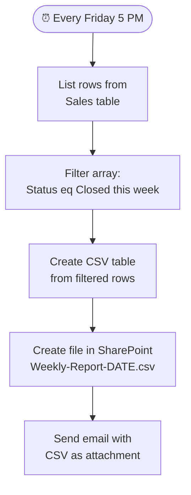

# Excel Online (Business) Connector

<span class="badge badge-green">Standard</span>

Automate Excel workbooks stored in SharePoint or OneDrive — read rows, add data, run Office Scripts, and build reports.

---

## Prerequisites

Your Excel file must:
1. Be stored in **SharePoint** or **OneDrive for Business** (not personal OneDrive)
2. Have data in a **named Table** (`Ctrl+T` in Excel to create one)
3. Not be open/locked by another user when the flow runs

---

## Key Actions

| Action | Description |
|--------|-------------|
| `List rows present in a table` | Read all rows from a table |
| `Add a row into a table` | Insert a new row |
| `Update a row` | Modify an existing row by key column |
| `Delete a row` | Remove a row by key column |
| `Get a row` | Retrieve one row by key |
| `Get tables` | List all tables in the workbook |
| `Get worksheets` | List all worksheets |
| `Create table` | Programmatically create a named table |
| `Run script` | Execute an Office Script (.ts) |
| `Run script from SharePoint library` | Run a shared Office Script |

---

## List Rows with Filtering

`List rows present in a table` supports **OData-style filtering**:

```
# Filter query examples:
Status eq 'Active'
Amount gt 1000
Department eq 'Sales' and Status eq 'Open'
```

**Limit:** By default, returns up to **256 rows**. Use `$top` or loop with `$skip` for more.

> ⚠️ Excel connector does not support server-side OData `$orderby` — sort in the flow using `Select` + array sorting.

---

## Add a Row — Dynamic Example

```json
Table: EmployeeLog
Row:
{
  "Name":       "@{triggerBody()?['name']}",
  "Department": "@{triggerBody()?['department']}",
  "JoinDate":   "@{formatDateTime(utcNow(), 'yyyy-MM-dd')}",
  "Status":     "Active"
}
```

---

## Update a Row

You need a **key column** — a column with unique values (like an ID or email):

```
Table:      EmployeeLog
Key Column: Email
Key Value:  john@company.com
Row:        { "Status": "Inactive", "LeftDate": "2024-12-01" }
```

> 💡 Only the columns you include in the row JSON are updated — other columns remain unchanged.

---

## Run Office Scripts for Complex Logic

When the connector's actions aren't enough, use **Office Scripts** (TypeScript-based macros):

```typescript
// Office Script example — calculate totals and write to a cell
function main(workbook: ExcelScript.Workbook, data: string): string {
  const sheet = workbook.getActiveWorksheet();
  const parsed = JSON.parse(data);

  // Write a value
  sheet.getRange("B2").setValue(parsed.total);

  // Read a value and return it
  const result = sheet.getRange("C2").getValue();
  return result.toString();
}
```

In the flow, use **`Run script`**:
- **Script:** Select your saved Office Script
- **Parameters:** Pass JSON data
- **Return value:** Use the script's return value as dynamic content

---

## Build a Dynamic Report — Full Example



---

## Common Mistakes

| Mistake | Fix |
|---------|-----|
| "Table not found" error | Verify table name is exact (case-sensitive) and the file path is correct |
| "File is locked" error | Another user has the file open; close it or schedule off-hours |
| Adding a row but columns mismatch | Column names in JSON must match table header names exactly |
| Updating wrong row | Key column must have truly unique values |
| Large workbook times out | Use Office Scripts for complex operations — they're faster |

---

## Pro Tips

- Always use **named Tables** not just cell ranges — connectors only work with tables.
- Use **`Run script`** for: bulk operations, complex calculations, formatting, or anything that would take many actions in a flow.
- Use **`Get tables`** at the start to verify the file is accessible before processing.
- For large datasets, combine Excel with **SharePoint lists** — lists scale better and support better filtering.
