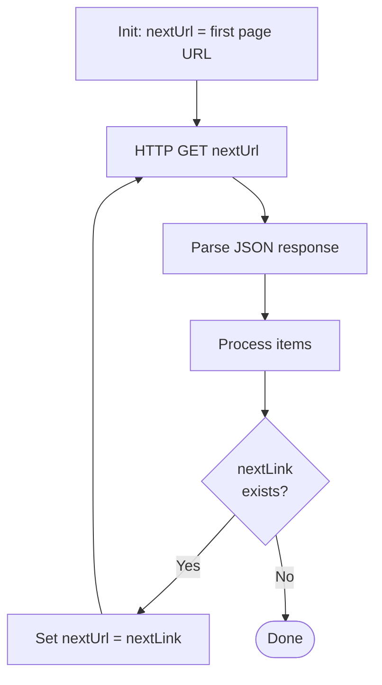

# HTTP & Webhooks Connector

<span class="badge badge-purple">Premium</span>

The HTTP connector lets you call **any REST API** in the world. It's the escape hatch when no dedicated connector exists.

---

## Three HTTP Actions

| Action | When to use |
|--------|------------|
| `HTTP` | Call any REST endpoint (GET, POST, PUT, PATCH, DELETE) |
| `HTTP + Swagger` | API has an OpenAPI/Swagger spec — import it for auto-complete |
| `HTTP Webhook` | Subscribe to a service that pushes events back to Power Automate |

### HTTP Trigger (inbound)
**`When an HTTP request is received`** — creates a unique URL that external systems can POST to. This makes Power Automate the server.

---

## HTTP Action — Basic GET

```json
Method: GET
URI: https://api.openweathermap.org/data/2.5/weather?q=Istanbul&appid=YOUR_KEY&units=metric
Headers:
  Accept: application/json
```

Parse the response with **`Parse JSON`**:
```json
Schema generated from sample:
{
  "main": { "temp": 22.3 },
  "weather": [{ "description": "clear sky" }]
}
```

---

## HTTP Action — POST with Auth

```json
Method: POST
URI: https://api.example.com/v1/orders
Headers:
  Content-Type: application/json
  Authorization: Bearer @{variables('accessToken')}
Body:
{
  "customerId": "@{triggerBody()?['customerId']}",
  "items": @{variables('orderItems')},
  "total": @{variables('orderTotal')}
}
```

---

## Authentication Options

| Method | Config |
|--------|--------|
| **None** | Public APIs |
| **Basic** | Username + password |
| **API key** | Header name + key value |
| **OAuth 2.0** | Client ID, secret, token URL — Power Automate handles token refresh |
| **Managed Identity** | Azure resources — no secrets stored |
| **Active Directory OAuth** | Azure AD apps |

> 🔴 Never hard-code secrets in flows. Use **Azure Key Vault** or **Environment Variables** to store API keys.

### Fetch a Secret from Key Vault

```json
Action: HTTP
Method: GET
URI: https://my-vault.vault.azure.net/secrets/MyApiKey?api-version=7.4
Authentication: Managed Identity (or Active Directory OAuth)
```

Returns `{ "value": "actual-secret-here" }` — then use `body('HTTP')?['value']` as your API key.

---

## Webhook (Inbound) — HTTP Request Trigger

Creates a unique URL that fires your flow:

```
When an HTTP request is received
Method: POST
Request body JSON schema:
{
  "type": "object",
  "properties": {
    "eventType": { "type": "string" },
    "payload":   { "type": "object" }
  }
}
```

The trigger outputs a **HTTP POST URL** — copy this URL and register it with the external system (GitHub webhooks, Stripe, etc.).

Respond to the caller with **`Response`** action:
```json
Action: Response
Status code: 200
Body: { "status": "received", "id": "@{guid()}" }
```

---

## Handling Pagination (next-page pattern)

Many APIs paginate results. Handle it with a **`Do until`** loop:



```
# Expression to get next page link (OData style)
body('HTTP')?['@odata.nextLink']

# Microsoft Graph style
body('HTTP')?['@odata.nextLink']

# GitHub style
outputs('HTTP')?['headers']?['Link']
```

---

## Retry Policy

In action Settings → Retry policy:

| Policy | When to use |
|--------|------------|
| **None** | Don't retry |
| **Default** | 4 retries, exponential backoff |
| **Fixed interval** | Retry every N seconds |
| **Exponential interval** | Increasing delays — good for rate limiting |

---

## Common Mistakes

| Mistake | Fix |
|---------|-----|
| 401 Unauthorized | Check auth type and credentials |
| 400 Bad Request | Check Content-Type header and JSON body syntax |
| SSL certificate error | Self-signed certs aren't supported — use a trusted CA |
| Timeout after 2 minutes | HTTP connector has a 2-minute timeout; for long operations use async polling |
| Body is string, not object | Wrap in `json()` expression: `json(body('HTTP'))` |

---

## Pro Tips

- Use **`HTTP + Swagger`** to import an OpenAPI spec — you get field auto-complete and validation.
- Set **`Retry policy: Exponential interval`** for external APIs that rate-limit.
- Parse the response with **`Parse JSON`** and use **"Generate from sample"** — paste a real response and it builds the schema.
- Always validate the HTTP status code: `outputs('HTTP')['statusCode']` — don't assume success just because the action didn't fail.
