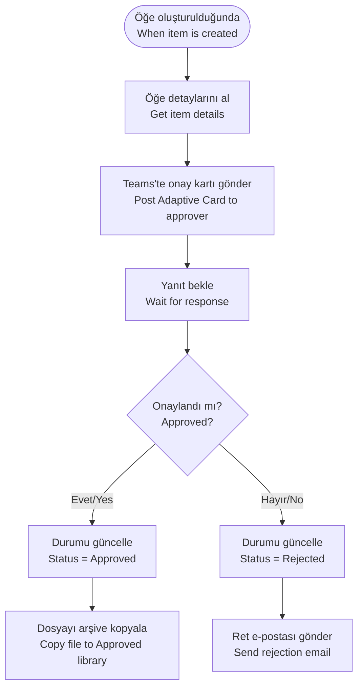

# SharePoint Connector

<span class="badge badge-green">Standard</span> <span class="badge badge-blue">Most Used</span>

## Bu Bağlayıcı Nedir? / What is This Connector?

**TR:** SharePoint, Microsoft'un dosya ve veri depolama platformudur. Bir şirket genelinde paylaşılan bir "dijital dolap" gibi düşünebilirsiniz: belgeler, listeler (Excel benzeri tablolar), görevler, duyurular — hepsi burada saklanır. Power Automate bu bağlayıcı ile bu dolabı otomatik olarak açıp kapayabilir, içindeki şeyleri okuyabilir, yazabilir ve güncelleyebilir.

**EN:** SharePoint is Microsoft's shared file and data storage platform — think of it as a company-wide digital filing cabinet. Documents, lists (like Excel tables), tasks, and announcements all live here. With this connector, Power Automate can automatically read from and write to that cabinet without anyone doing it manually.

---

## Ne Zaman Kullanılır? / When Would You Use It?

**TR — Tipik senaryolar:**
- Bir SharePoint listesine yeni kayıt eklendiğinde otomatik e-posta veya Teams mesajı gönder
- Doldurulan bir form verisini SharePoint listesine kaydet
- Onay bekleyen bir belgeyi ilgili kişiye Teams üzerinden bildir
- Belirli bir klasöre yüklenen dosyaları tarayıp işle
- Her gece çalışarak eski kayıtları arşiv listesine taşı

**EN — Typical scenarios:**
- New SharePoint list item → send email / Teams notification automatically
- Form submission → save data to a SharePoint list
- File uploaded to a library → kick off an approval workflow
- Nightly job → move old records to an archive list
- Read a list and build a daily summary report

---

## Nasıl Başlanır? / How to Start (First Steps)

**TR:**
1. Power Automate'te yeni akış oluşturun
2. Tetikleyici olarak `Öğe oluşturulduğunda (When an item is created)` seçin
3. **Site Adresi:** SharePoint sitenizin URL'sini girin (ör. `https://sirket.sharepoint.com/sites/HR`)
4. **Liste Adı:** Açılır menüden listeyi seçin
5. Sonraki adıma eylem ekleyin (ör. Teams mesajı gönder)

**EN:**
1. Create a new flow in Power Automate
2. Choose trigger: `When an item is created`
3. **Site Address:** Enter your SharePoint site URL (e.g. `https://company.sharepoint.com/sites/HR`)
4. **List Name:** Pick the list from the dropdown
5. Add an action after (e.g. send a Teams message)

> 💡 **TR:** Liste adlarını elle yazmayın — her zaman açılır menüden seçin, yazım hatası olasılığını sıfıra indirirsiniz. / **EN:** Never type list names manually — always use the dropdown picker to avoid typos.

---

## Triggers

| Tetikleyici / Trigger | Açıklama / Description |
|----------------------|------------------------|
| `When an item is created` | Yeni liste kaydı oluştuğunda / Fires when a new list item appears |
| `When an item is created or modified` | Oluşturma veya güncellemede / Fires on both creates and updates |
| `When an item is deleted` | Kayıt silindiğinde (versiyonlama gerekli) / On delete (requires versioning) |
| `When a file is created (properties only)` | Kitaplığa yeni belge eklendiğinde / New document in a library |
| `When a file is created or modified (properties only)` | Yeni veya güncellenen belge / New or updated document |
| `For a selected item` | Kullanıcı elle tetikler / Manual — user selects a list item and runs |

> ⚠️ **TR:** SharePoint tetikleyicileri gerçek zamanlı değil, belirli aralıklarla kontrol eder. Premium planlarda **her dakika**, standart planlarda **her 5 dakika** kontrol edilir. / **EN:** SharePoint triggers poll on a schedule, not true real-time. Default is **every minute** (premium) or **every 5 minutes** (standard).

---

## Key Actions

### Item (List) Actions / Öğe (Liste) Eylemleri

| Eylem / Action | Kullanım / Use Case |
|----------------|---------------------|
| `Get items` | Birden fazla kayıt çek, filtrele / Fetch multiple items (supports OData filter, sort, limit) |
| `Get item` | ID ile tek kayıt çek / Fetch a single item by ID |
| `Create item` | Yeni liste kaydı oluştur / Add a new list item |
| `Update item` | Mevcut kaydı güncelle / Modify existing item fields |
| `Delete item` | Kaydı sil / Remove an item |

### File / Library Actions / Dosya Eylemleri

| Eylem / Action | Kullanım / Use Case |
|----------------|---------------------|
| `Create file` | Kitaplığa yeni dosya yükle / Upload a new file to a library |
| `Get file content` | Dosya içeriğini indir / Download a file's bytes |
| `Get file metadata` | Dosya özelliklerini oku / Read file properties (name, size, URL…) |
| `Update file` | Dosya içeriğini değiştir / Replace file content |
| `Delete file` | Dosyayı sil / Remove a file |
| `Move or rename a file` | Taşı veya yeniden adlandır / Change location or name |
| `Copy file` | Dosyayı kopyala / Duplicate a file |
| `Get files (properties only)` | Meta verilerle dosyaları listele / List files with metadata, no download |

### Attachment Actions / Ek Dosya Eylemleri

| Eylem / Action | Kullanım / Use Case |
|----------------|---------------------|
| `Add attachment` | Liste kaydına dosya ekle / Attach a file to a list item |
| `Get attachments` | Tüm ekleri listele / List all attachments on an item |
| `Get attachment content` | Eki indir / Download a specific attachment |
| `Delete attachment` | Eki sil / Remove an attachment |

### Advanced / Gelişmiş

| Eylem / Action | Kullanım / Use Case |
|----------------|---------------------|
| `Send an HTTP request to SharePoint` | Tam SharePoint REST API erişimi / Full REST API access |
| `Get all lists and libraries` | Site yapısını listele / Enumerate site structure |
| `Get folder metadata` | Klasör özelliklerini oku / Read folder properties |
| `List folder` | Klasör içeriğini listele / List items inside a folder |

---

## OData Filtering — Getting Only What You Need / Sadece İhtiyacınız Olanı Çekin

**TR:** Tüm listeyi çekip akış içinde filtrelemek yerine, filtreleyi SharePoint'e gönderin — çok daha hızlı çalışır.

**EN:** Instead of fetching all items and filtering in the flow, filter **server-side** using OData in the `Filter Query` field:

```
# Items where Status = Active / Durumu Aktif olanlar
Status eq 'Active'

# Items modified today / Bugün güncellenenler
Modified ge '@{startOfDay(utcNow())}'

# Items where category is either Bug or Feature
Category eq 'Bug' or Category eq 'Feature'

# Items not archived / Arşivlenmemişler
IsArchived eq 0
```

**Top Count** — max döndürülecek kayıt sayısı / limit returned items (default 100, max 5000):
```
Top Count: 500
```

**Order By:**
```
Created desc
```

> 💡 **TR:** 5.000'den fazla öğeli listeler için SharePoint bir limit uygular. Filtre sütunlarınızın **dizinlenmiş (indexed)** olduğundan emin olun. / **EN:** For lists larger than 5,000 items, use indexed columns in your filter queries.

---

## Send an HTTP Request to SharePoint / Gelişmiş HTTP İsteği

**TR:** Standart eylemlerin yetmediği durumlarda SharePoint'in REST API'sine doğrudan erişim sağlar.

**EN:** The most powerful action — bypasses standard action limitations:

```http
Method: GET
Uri: _api/web/lists/getbytitle('My List')/items?$select=Title,Status&$filter=Status eq 'Active'&$top=100
Headers:
  Accept: application/json;odata=verbose
```

```http
Method: POST
Uri: _api/web/lists/getbytitle('Tasks')/items
Headers:
  Accept: application/json;odata=verbose
  Content-Type: application/json;odata=verbose
Body:
{
  "__metadata": { "type": "SP.Data.TasksListItem" },
  "Title": "New Task",
  "Priority": "High"
}
```

> 💡 To find the `__metadata.type` for your list: call `_api/web/lists/getbytitle('ListName')?$select=ListItemEntityTypeFullName`

---

## Real-World Example: Approval and Archive Flow / Gerçek Örnek: Onay ve Arşiv



---

## Common Mistakes / Sık Yapılan Hatalar

| Hata / Mistake | Çözüm / Fix |
|----------------|-------------|
| Sütun adı yanlış / Display name used | Listedeki iç adı (internal name) kullanın — liste ayarlarında URL'den görülebilir / Check column internal name in list settings |
| 5000 öğe limiti aşıldı / List view threshold | Filtre sütunlarını dizinleyin (Index) / Add indexed columns and use filter queries |
| Site URL sabit yazılmış / Hard-coded site URL | Ortam değişkeni kullanın / Use environment variables or a named connection |
| Çoklu seçim sütunu boş görünüyor | `join(item()?['MyMultiChoice']?['results'], ', ')` ifadesini kullanın |
| Öğe güncelleme tüm sütunları siliyor / Update overwrites | Sadece değiştireceğiniz sütunları dahil edin / Only include columns you want to change |

---

## Pro Tips / İpuçları

- `Get items` + OData filtresi + `Top Count: 1` → bir öğenin var olup olmadığını kontrol etmek için / Use as a "find" operation.
- `Send HTTP request to SharePoint` → toplu işlemler için API batch'ini kullanın / call batch operations to reduce API calls.
- OData filtrelerinde her zaman **iç sütun adlarını** (internal names) kullanın, görünen adları değil / Always use column **internal names** in OData filters.
- Çoklu seçim değerlerini metin olarak göstermek için: `join(item()?['MyMultiChoice']?['results'], ', ')`.
