# SharePoint Connector

<span class="badge badge-green">Standard</span> <span class="badge badge-blue">Most Used</span>

The SharePoint connector is one of the most powerful in Power Automate. It covers lists, libraries, files, and full REST API access.

---

## Triggers

| Trigger | Description |
|---------|-------------|
| `When an item is created` | Fires when a new list item appears |
| `When an item is created or modified` | Fires on both creates and updates |
| `When an item is deleted` | Fires when an item is deleted (requires versioning) |
| `When a file is created (properties only)` | New document in a library |
| `When a file is created or modified (properties only)` | New or updated document |
| `For a selected item` | Manual — user selects a list item and runs |

> ⚠️ SharePoint triggers poll on a schedule (not true real-time). Default polling interval is **every minute** on premium plans, **every 5 minutes** on standard.

---

## Key Actions

### Item (List) Actions

| Action | Use Case |
|--------|---------|
| `Get items` | Fetch multiple items (supports OData filter, sort, limit) |
| `Get item` | Fetch a single item by ID |
| `Create item` | Add a new list item |
| `Update item` | Modify existing item fields |
| `Delete item` | Remove an item |

### File / Library Actions

| Action | Use Case |
|--------|---------|
| `Create file` | Upload a new file to a library |
| `Get file content` | Download a file's bytes |
| `Get file metadata` | Read file properties (name, size, URL…) |
| `Update file` | Replace file content |
| `Delete file` | Remove a file |
| `Move or rename a file` | Change location or name |
| `Copy file` | Duplicate a file |
| `Get files (properties only)` | List files with metadata, no download |

### Attachment Actions (List items)

| Action | Use Case |
|--------|---------|
| `Add attachment` | Attach a file to a list item |
| `Get attachments` | List all attachments on an item |
| `Get attachment content` | Download a specific attachment |
| `Delete attachment` | Remove an attachment |

### Advanced

| Action | Use Case |
|--------|---------|
| `Send an HTTP request to SharePoint` | Full SharePoint REST API access |
| `Get all lists and libraries` | Enumerate site structure |
| `Get folder metadata` | Read folder properties |
| `List folder` | List items inside a folder |

---

## OData Filtering — Getting Only What You Need

Instead of fetching all items and filtering in the flow, filter **server-side** using OData in the `Filter Query` field:

```
# Items where Status = Active
Status eq 'Active'

# Items modified today
Modified ge '@{startOfDay(utcNow())}'

# Items where category is either Bug or Feature
Category eq 'Bug' or Category eq 'Feature'

# Items not archived, sorted by Created descending
IsArchived eq 0
```

**Top Count** — limit how many items are returned (default 100, max 5000):
```
Top Count: 500
```

**Order By:**
```
Created desc
```

> 💡 For lists larger than 5,000 items, SharePoint imposes a throttle. Use indexed columns in your filter queries.

---

## Send an HTTP Request to SharePoint

The most powerful action — bypasses standard action limitations:

```http
Method: GET
Uri: _api/web/lists/getbytitle('My List')/items?$select=Title,Status&$filter=Status eq 'Active'&$top=100
Headers:
  Accept: application/json;odata=verbose
```

```http
Method: POST
Uri: _api/web/lists/getbytitle('Tasks')/items
Headers:
  Accept: application/json;odata=verbose
  Content-Type: application/json;odata=verbose
Body:
{
  "__metadata": { "type": "SP.Data.TasksListItem" },
  "Title": "New Task",
  "Priority": "High"
}
```

> 💡 To find the `__metadata.type` for your list: call `_api/web/lists/getbytitle('ListName')?$select=ListItemEntityTypeFullName`

---

## Real-World Example: Approval and Archive Flow

```mermaid
flowchart TD
    T([📋 When item is created]) --> GI[Get item details]
    GI --> AC[Post Adaptive Card\nto approver in Teams]
    AC --> WAIT[Wait for response]
    WAIT --> COND{Approved?}
    COND -->|Yes| UPD[Update item\nStatus = Approved]
    COND -->|No| REJ[Update item\nStatus = Rejected]
    UPD --> COPY[Copy file to\nApproved library]
    REJ --> NOTIF[Send rejection email]
```



---

## Common Mistakes

| Mistake | Fix |
|---------|-----|
| Using Display Name instead of Internal Name for columns | Check column internal name in list settings (URL) |
| Forgetting to handle list view threshold (5000 item limit) | Add indexed columns and use filter queries |
| Hard-coding site URL | Use environment variables or a named connection |
| Not handling `null` values in multi-choice columns | Use `if(empty(...), '', ...)` expression |
| Update item overwrites all columns | Only include columns you want to change |

---

## Pro Tips

- Use **`Get items`** with OData filter + `Top Count: 1` to check if an item exists (like a "find" operation).
- Use **`Send HTTP request to SharePoint`** to call batch operations and reduce API calls.
- Always use **column internal names** (not display names) in OData filters.
- For multi-select columns, the value is a JSON object — use `join(item()?['MyMultiChoice']?['results'], ', ')` to display them as text.
