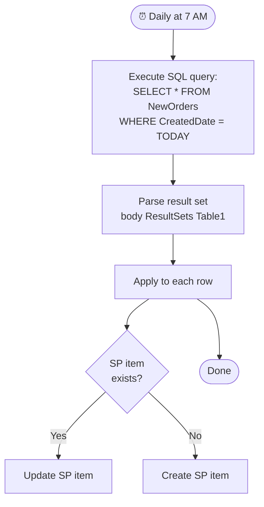

# SQL Server Connector

<span class="badge badge-purple">Premium</span> <span class="badge badge-orange">Security-sensitive</span>

Connect to SQL Server (Azure SQL, on-premises SQL Server, SQL Managed Instance) to query, insert, update, and delete data.

---

## Connection Options

| Option | When to use |
|--------|------------|
| **Azure SQL** | Cloud-hosted, no gateway needed |
| **On-premises SQL Server** | Requires **On-premises data gateway** installed |
| **SQL Managed Instance** | Azure managed, direct connection possible |

> ⚠️ For on-premises SQL Server, install the [On-premises data gateway](https://learn.microsoft.com/en-us/data-integration/gateway/service-gateway-install) on a machine in the same network as the SQL Server.

---

## Key Actions

| Action | Description |
|--------|-------------|
| `Execute a SQL query (V2)` | Run any SQL (SELECT, INSERT, UPDATE, DELETE) |
| `Execute stored procedure (V2)` | Call a stored procedure with parameters |
| `Get rows (V2)` | Fetch rows from a table with optional filter/sort |
| `Get row (V2)` | Get one row by primary key |
| `Insert row (V2)` | Add a new row |
| `Update row (V2)` | Modify existing row by key |
| `Delete row (V2)` | Remove a row by key |
| `Get tables (V2)` | List all tables in the database |

---

## Execute a SQL Query — Safely

> 🔴 **NEVER build queries by concatenating user input.** This creates SQL injection vulnerabilities.

**Wrong (vulnerable):**
```sql
SELECT * FROM Users WHERE Name = '@{triggerBody()?['name']}'
```

**Right (use stored procedures or parameterized queries via Execute stored procedure):**

```sql
-- Create this stored procedure in SQL Server first:
CREATE PROCEDURE GetUserByName
  @Name NVARCHAR(100)
AS
BEGIN
  SELECT * FROM Users WHERE Name = @Name
END
```

Then in Power Automate:
```json
Action: Execute stored procedure (V2)
Procedure name: GetUserByName
Parameters:
  @Name: @{triggerBody()?['name']}
```

---

## Get Rows with Filter

```json
Action: Get rows (V2)
Table name: Orders
Filter query: Status eq 'Pending' and Amount gt 500
Order by: CreatedDate desc
Top count: 100
```

> 💡 `Get rows` uses OData-style syntax even though it's talking to SQL. For complex queries, always use `Execute a SQL query` with a stored procedure.

---

## Handling the Response

`Execute a SQL query` returns:

```json
{
  "ResultSets": {
    "Table1": [
      { "Id": 1, "Name": "Alice", "Amount": 1500 },
      { "Id": 2, "Name": "Bob",   "Amount": 800  }
    ]
  }
}
```

Access rows: `body('Execute_a_SQL_query')?['ResultSets']?['Table1']`

Use with **`Apply to each`** to process each row.

---

## Full Example: Sync SQL to SharePoint Daily



---

## Common Mistakes

| Mistake | Fix |
|---------|-----|
| Gateway offline | Check gateway service status; add redundancy with cluster gateway |
| SQL injection risk | Always use stored procedures or parameterized queries |
| Timeout on large queries | Add `SET NOCOUNT ON`; use pagination (OFFSET/FETCH); index columns |
| "Login failed" error | Check SQL login credentials; firewall rules for Azure SQL |
| V1 vs V2 actions | Always prefer V2 — V1 is deprecated |

---

## Pro Tips

- Use **stored procedures** for all non-trivial queries — they're safer, faster, and easier to maintain than inline SQL.
- Add **`SET NOCOUNT ON`** at the top of stored procedures to suppress row-count messages that can slow down the connector.
- For Azure SQL, configure **firewall rules** to allow Power Automate's IP ranges (or use a VNET integration).
- Handle large result sets with SQL pagination:

```sql
CREATE PROCEDURE GetPagedOrders
  @PageSize INT = 100,
  @PageNumber INT = 1
AS
BEGIN
  SET NOCOUNT ON;
  SELECT * FROM Orders
  ORDER BY Id
  OFFSET (@PageNumber - 1) * @PageSize ROWS
  FETCH NEXT @PageSize ROWS ONLY;
END
```
