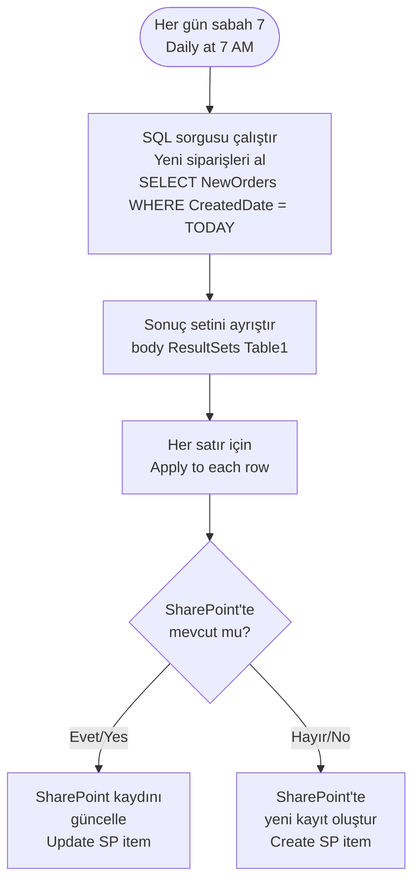

# SQL Server Connector

<span class="badge badge-purple">Premium</span> <span class="badge badge-orange">Security-sensitive</span>

## Bu Bağlayıcı Nedir? / What is This Connector?

**TR:** SQL Server, şirketlerin büyük miktarda yapılandırılmış veriyi depoladığı güçlü bir veritabanı sistemidir. Müşteri kayıtları, siparişler, envanter, finansal veriler genellikle burada saklanır. Azure üzerinde barındırılan (Azure SQL), şirket sunucusunda çalışan (On-premises) veya yönetilen (SQL Managed Instance) versiyonları vardır. Power Automate bu bağlayıcı ile veritabanına bağlanıp SQL sorguları çalıştırabilir, veri ekleyip güncelleyebilir — kod yazan bir yazılımcı gibi, ama akış mantığıyla.

> ⚠️ **TR:** Bu bağlayıcı **Premium** lisans gerektirir. Şirket içi SQL sunucusu için ek olarak **On-premises Data Gateway** kurulması gerekir.

**EN:** SQL Server is one of the most widely used enterprise database systems — it stores customers, orders, inventory, financial records, and more. Power Automate can connect to Azure SQL, on-premises SQL Server, or SQL Managed Instance to query, insert, update, and delete data — no developer needed for common automation tasks.

> ⚠️ **EN:** Requires **Premium** license. On-premises SQL Server additionally requires the **On-premises Data Gateway** installed on a machine in the same network.

---

## Ne Zaman Kullanılır? / When Would You Use It?

**TR — Tipik senaryolar:**
- Her gece SQL'deki yeni siparişleri çek, SharePoint listesine aktar
- Microsoft Forms'tan gelen müşteri bilgisini doğrudan SQL tablosuna kaydet
- SQL'deki durumu "Pending" olan kayıtları işle, sonucuna göre e-posta gönder
- ERP sistemindeki verileri Power BI raporları için SQL'e gönder
- Belirli bir eşiği aşan (ör. 10.000₺ sipariş) kayıtlar oluştuğunda yöneticiye Teams bildirimi gönder

**EN — Typical scenarios:**
- Every night → fetch new SQL orders, push them to a SharePoint list
- Form submission → save customer data directly to a SQL table
- Records with status "Pending" → process each, send emails based on result
- ETL pipeline → move data between SQL and other systems (Dataverse, SharePoint)
- Order exceeds $10,000 → send immediate Teams alert to manager

---

## Nasıl Başlanır? / How to Start (First Steps)

**TR:**
1. Akışa `Get rows (V2)` eylemini ekleyin
2. **Server name:** SQL sunucu adresini girin (ör. `myserver.database.windows.net`)
3. **Database name:** Veritabanı adını girin
4. **Authentication:** Kullanıcı adı/şifre veya Windows kimlik doğrulaması
5. **Table name:** Açılır menüden tabloyu seçin
6. İsteğe bağlı: **Filter query** ile sadece ihtiyacınız olan satırları filtreleyin

**EN:**
1. Add `Get rows (V2)` action to your flow
2. **Server name:** Enter your SQL server address (e.g. `myserver.database.windows.net`)
3. **Database name:** Enter the database name
4. **Authentication:** Username/password or Windows auth
5. **Table name:** Pick from the dropdown
6. Optional: add a **Filter query** to retrieve only what you need

---

## Connection Options / Bağlantı Seçenekleri

| Seçenek / Option | Ne Zaman / When to use |
|------------------|------------------------|
| **Azure SQL** | Bulut barındırmalı, gateway gerekmez / Cloud-hosted, no gateway needed |
| **On-premises SQL Server** | Şirket sunucusu, **On-premises data gateway** kurulumu gerekir / Requires gateway installed on local network |
| **SQL Managed Instance** | Azure yönetimli, doğrudan bağlantı / Azure managed, direct connection possible |

> ⚠️ **TR:** Şirket içi SQL için [On-premises data gateway](https://learn.microsoft.com/en-us/data-integration/gateway/service-gateway-install) kurulumu gereklidir — BT ekibinizle koordine edin. / **EN:** For on-premises SQL, install the On-premises data gateway on a machine in the same network as the SQL Server.

---

## Key Actions / Temel Eylemler

| Eylem / Action | Açıklama / Description |
|----------------|------------------------|
| `Execute a SQL query (V2)` | Herhangi bir SQL çalıştır (SELECT, INSERT, UPDATE, DELETE) / Run any SQL |
| `Execute stored procedure (V2)` | Parametreli stored procedure çağır / Call a stored procedure with parameters |
| `Get rows (V2)` | Tablodan filtreli/sıralı satır çek / Fetch rows with optional filter/sort |
| `Get row (V2)` | Primary key ile tek satır çek / Get one row by primary key |
| `Insert row (V2)` | Yeni satır ekle / Add a new row |
| `Update row (V2)` | Mevcut satırı güncelle / Modify existing row by key |
| `Delete row (V2)` | Satırı sil / Remove a row by key |
| `Get tables (V2)` | Veritabanındaki tabloları listele / List all tables in the database |

---

## Execute a SQL Query — Güvenli Kullanım / Safely

> 🔴 **TR:** Kullanıcı girişini doğrudan SQL sorgusuna asla eklemeyin — bu **SQL injection** saldırısına yol açar. / **EN:** **NEVER** build queries by string-concatenating user input — this creates **SQL injection** vulnerabilities.

**Yanlış / Wrong (savunmasız / vulnerable):**
```sql
SELECT * FROM Users WHERE Name = '@{triggerBody()?['name']}'
```

**Doğru / Right — Stored procedure kullanın / Use stored procedures:**

```sql
-- Önce SQL Server'da bu procedure'ü oluşturun / Create this in SQL Server first:
CREATE PROCEDURE GetUserByName
  @Name NVARCHAR(100)
AS
BEGIN
  SELECT * FROM Users WHERE Name = @Name
END
```

```json
Eylem / Action: Execute stored procedure (V2)
Procedure name: GetUserByName
Parameters:
  @Name: @{triggerBody()?['name']}
```

---

## Get Rows with Filter / Filtreli Satır Çekme

```json
Eylem / Action: Get rows (V2)
Table name: Orders
Filter query: Status eq 'Pending' and Amount gt 500
Order by: CreatedDate desc
Top count: 100
```

> 💡 **TR:** `Get rows` OData sözdizimi kullanır. Karmaşık sorgular için her zaman `Execute a SQL query` + stored procedure kullanın. / **EN:** `Get rows` uses OData-style syntax. For complex queries, use `Execute a SQL query` with a stored procedure.

---

## Handling the Response / Yanıtı İşleme

**TR:** `Execute a SQL query` şu yapıda döner:

**EN:** `Execute a SQL query` returns:

```json
{
  "ResultSets": {
    "Table1": [
      { "Id": 1, "Name": "Alice", "Amount": 1500 },
      { "Id": 2, "Name": "Bob",   "Amount": 800  }
    ]
  }
}
```

**TR:** Satırlara erişim ve döngü / Access rows and loop:
```
body('Execute_a_SQL_query')?['ResultSets']?['Table1']
```
→ **`Apply to each`** ile her satırı işleyin / Use with `Apply to each` to process each row.

---

## Full Example / Tam Örnek: SQL → SharePoint Günlük Senkronizasyon



---

## Common Mistakes / Sık Yapılan Hatalar

| Hata / Mistake | Çözüm / Fix |
|----------------|-------------|
| Gateway çevrimdışı / Gateway offline | Gateway servis durumunu kontrol edin; küme gateway ile yedeklilik ekleyin / Check gateway status; add cluster gateway for redundancy |
| SQL injection riski | Her zaman stored procedure veya parameterized query kullanın / Always use stored procedures |
| Büyük sorgularda zaman aşımı / Timeout on large queries | `SET NOCOUNT ON` ekleyin; sayfalandırma kullanın; sütunları indexleyin / Add `SET NOCOUNT ON`; use pagination; index columns |
| "Login failed" hatası / "Login failed" error | SQL kullanıcı bilgilerini ve Azure SQL güvenlik duvarı kurallarını kontrol edin / Check credentials and firewall rules |
| V1 vs V2 eylemler / V1 vs V2 actions | Her zaman V2 kullanın — V1 kullanımdan kaldırıldı / Always prefer V2 — V1 is deprecated |

---

## Pro Tips / İpuçları

- Tüm karmaşık sorgular için **stored procedure** kullanın — daha güvenli, daha hızlı ve bakımı kolay / Use for all non-trivial queries.
- Stored procedure'lerin başına **`SET NOCOUNT ON`** ekleyin — satır sayısı mesajlarını bastırır, bağlayıcıyı hızlandırır / Suppresses row-count messages.
- Azure SQL için Power Automate'in IP aralıklarına izin veren **güvenlik duvarı kuralı** ekleyin (veya VNET entegrasyonu kullanın) / Configure firewall rules.
- Büyük veri setleri için **SQL sayfalandırması** kullanın:

```sql
CREATE PROCEDURE GetPagedOrders
  @PageSize INT = 100,
  @PageNumber INT = 1
AS
BEGIN
  SET NOCOUNT ON;
  SELECT * FROM Orders
  ORDER BY Id
  OFFSET (@PageNumber - 1) * @PageSize ROWS
  FETCH NEXT @PageSize ROWS ONLY;
END
```
