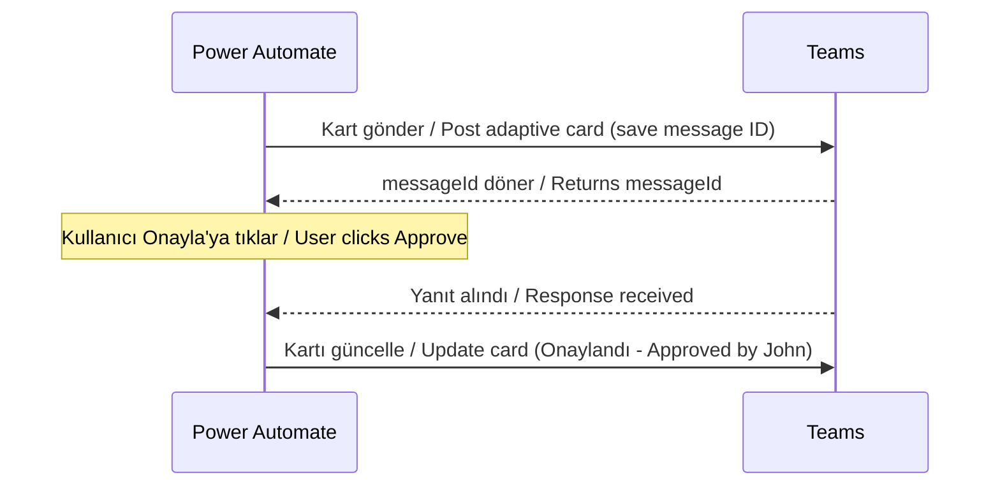

# Microsoft Teams Connector

<span class="badge badge-green">Standard</span> <span class="badge badge-purple">Adaptive Cards</span>

## Bu Bağlayıcı Nedir? / What is This Connector?

**TR:** Microsoft Teams, şirket içi iletişim ve iş birliği platformudur — sohbet, toplantı, kanal mesajları ve dosya paylaşımı burada gerçekleşir. Power Automate bu bağlayıcı ile Teams'e otomatik mesajlar gönderebilir, etkileşimli kartlar paylaşabilir ve kullanıcıların yanıtlarını toplayabilir. Kısacası: akışınız Teams üzerinden insanlarla "konuşabilir" ve onların kararlarını bekleyebilir.

**EN:** Microsoft Teams is where your company chats, meets, and collaborates. With this connector, Power Automate can post messages to channels or chats, send interactive Adaptive Cards (rich forms inside Teams), and wait for a human response before continuing — making it ideal for approval and notification scenarios.

---

## Ne Zaman Kullanılır? / When Would You Use It?

**TR — Tipik senaryolar:**
- Yeni bir SharePoint kaydı oluştuğunda ilgili Teams kanalına bildirim gönder
- Onay gerektiren durumlarda yöneticiye Teams kartı gönder; "Onayla" veya "Reddet" butonuna basmasını bekle
- Hata oluştuğunda belirlenen bir kanalı uyar
- Günlük/haftalık raporu belirli bir kanala otomatik paylaş
- Yeni çalışan geldiğinde "Hoş geldiniz" mesajı gönder

**EN — Typical scenarios:**
- New request in SharePoint → post a notification to a Teams channel
- Approval needed → send a card to a manager, wait for Approve/Reject, then act
- Flow error → alert an ops channel automatically
- Every Monday morning → post a weekly summary to a team channel
- New employee starts → send a welcome message to the onboarding channel

---

## Nasıl Başlanır? / How to Start (First Steps)

**TR:**
1. Akışınıza `Post message in a chat or channel` eylemini ekleyin
2. **Post as:** `Flow bot` seçin (akış kendi adına mesaj atar)
3. **Post in:** `Channel` seçin
4. **Team:** Açılır menüden takımı seçin
5. **Channel:** Kanalı seçin
6. **Message:** Mesajınızı yazın, dinamik içerik ekleyin

**EN:**
1. Add the `Post message in a chat or channel` action to your flow
2. **Post as:** `Flow bot` (the flow posts on its own behalf)
3. **Post in:** `Channel`
4. **Team:** Pick from the dropdown
5. **Channel:** Pick from the dropdown
6. **Message:** Write your message, insert dynamic content

> 💡 **TR:** Mesaj alanı temel HTML destekler: `<b>kalın</b>`, `<br>`, `<a href="url">link</a>`. / **EN:** The Message field supports basic HTML: `<b>bold</b>`, `<br>`, `<a href="url">link</a>`.

---

## Key Actions / Temel Eylemler

| Eylem / Action | Kullanım / Use Case |
|----------------|---------------------|
| `Post message in a chat or channel` | Kanal veya sohbete metin/HTML mesaj / Simple text or HTML message |
| `Post card in a chat or channel` | Hazır Adaptive Card gönder / Send a pre-built Adaptive Card |
| `Post adaptive card and wait for a response` | Kart gönder, yanıt gelene kadar dur / Send card and pause until someone responds |
| `Update an adaptive card in a chat or channel` | Gönderilen kartı güncelle / Refresh a card already posted |
| `Create a Teams meeting` | Programatik toplantı oluştur / Schedule a meeting programmatically |
| `Create a team` / `Create a channel` | Otomatik takım/kanal oluşturma / Provisioning automation |
| `Get @mention token for a user` | Birini etiketle / Tag someone in a message |
| `Send a Microsoft Graph HTTP request` | Tam Graph API erişimi / Full Graph API access |

---

## Posting a Simple Message / Basit Mesaj Gönderme

```json
Post as:   Flow bot
Post in:   Channel
Team:      [Takımınız / Your team]
Channel:   [Kanalınız / Your channel]
Message:   Yeni kayıt oluşturuldu / New item created: @{triggerBody()?['Title']}
           Oluşturan / Created by: @{triggerBody()?['Author/DisplayName']}
```

---

## Adaptive Cards — Etkileşimli Kartlar

**TR:** Adaptive Card, Teams içinde görünen bir "mini form" gibi düşünebilirsiniz. Düğmeler, metin kutuları, onay kutuları ekleyebilirsiniz. Kullanıcı yanıt verdiğinde akışınız devam eder. Tasarım için: **[adaptivecards.io/designer](https://adaptivecards.io/designer/)**

**EN:** An Adaptive Card is like a mini-form inside Teams. You can add buttons, text inputs, and dropdowns. When the user responds, your flow continues. Design yours at: **[adaptivecards.io/designer](https://adaptivecards.io/designer/)**

### Minimal Approval Card / Onay Kartı

```json
{
  "$schema": "http://adaptivecards.io/schemas/adaptive-card.json",
  "type": "AdaptiveCard",
  "version": "1.5",
  "body": [
    {
      "type": "TextBlock",
      "text": "Onay Gerekiyor / Approval Required",
      "weight": "Bolder",
      "size": "Large"
    },
    {
      "type": "FactSet",
      "facts": [
        { "title": "Öğe / Item:", "value": "${Title}" },
        { "title": "Talep Eden / Requested by:", "value": "${RequestedBy}" },
        { "title": "Tarih / Date:", "value": "${Date}" }
      ]
    },
    {
      "type": "Input.Text",
      "id": "comments",
      "placeholder": "Yorumlarınız / Optional comments…",
      "isMultiline": true
    }
  ],
  "actions": [
    {
      "type": "Action.Submit",
      "title": "Onayla / Approve",
      "style": "positive",
      "data": { "action": "approve" }
    },
    {
      "type": "Action.Submit",
      "title": "Reddet / Reject",
      "style": "destructive",
      "data": { "action": "reject" }
    }
  ]
}
```

**TR:** `${Title}`, `${RequestedBy}`, `${Date}` değerlerini göndermeden önce akışınızdaki dinamik içerikle değiştirin.

**EN:** Replace `${Title}`, `${RequestedBy}`, `${Date}` with dynamic content from your flow before sending.

### Reading the Card Response / Yanıtı Okuma

```
# Kullanıcının seçimi (approve/reject) / Check the action
outputs('Post_adaptive_card_and_wait_for_a_response')?['body/data/action']

# Kullanıcının yazdığı yorum / Get comments entered by user
outputs('Post_adaptive_card_and_wait_for_a_response')?['body/data/comments']

# Yanıtlayanın adı / Who responded
outputs('Post_adaptive_card_and_wait_for_a_response')?['body/responder/displayName']
```

---

## Updating a Card After a Response / Yanıt Sonrası Kartı Güncelleme

**TR:** Onay verildikten sonra orijinal kartı "Onaylandı ✅" şeklinde güncellemek iyi bir pratiktir — kullanıcılar kartın durumunu görebilir.

**EN:** After approval, update the original card to show "Approved ✅" — it prevents confusion about whether the card was acted on.



Use `Update an adaptive card in a chat or channel` with the `messageId` saved from the original post.

---

## @Mention a User / Kullanıcı Etiketleme

```
1. Eylem / Action: "Get @mention token for a user"
   User: kisi@sirket.com

2. Eylem / Action: "Post message in a chat or channel"
   Message: Merhaba [mention token], lütfen bu öğeyi inceleyin.
             Hello [mention token], please review this item.
```

---

## Send a Graph API Request / Graph API İsteği

**TR:** Standart eylemlerle yapılamayanlara Graph API üzerinden erişin.

**EN:** For things not covered by standard actions:

```http
Method: GET
Url: v1.0/teams/{teamId}/channels/{channelId}/messages
```

```http
Method: POST
Url: v1.0/chats/{chatId}/messages
Body:
{
  "body": {
    "contentType": "html",
    "content": "<b>Power Automate'ten merhaba! / Hello from Power Automate!</b>"
  }
}
```

---

## Common Mistakes / Sık Yapılan Hatalar

| Hata / Mistake | Çözüm / Fix |
|----------------|-------------|
| Takım/Kanal ID yanlış / Team or Channel ID wrong | Manuel GUID girmeyin; açılır menüyü kullanın / Use the dropdown, not manual GUID entry |
| Adaptive Card JSON hatası / JSON syntax error | [adaptivecards.io/designer](https://adaptivecards.io/designer/) üzerinde önce doğrulayın / Validate there first |
| Yanıt bekleme zaman aşımı / Wait for response times out | Varsayılan 30 gün; Ayarlar → Zaman Aşımı'ndan kısaltın / Default is 30 days; set shorter in Settings → Timeout |
| Kart girdi alanları görünmüyor / Card not showing inputs | `Input.*` öğeleri `version: "1.5"` gerektirir / Requires `version: "1.5"` or higher |
| Bot adı değiştirilemiyor | "Power Automate" olarak görünmesi normaldir / Expected — can't rename in standard connector |

---

## Pro Tips / İpuçları

- **`Update an adaptive card`** kullanarak onay/ret sonucunu orijinal kartta gösterin — kullanıcı kafa karışıklığı yaşamaz / Show the result on the original card.
- **`Post a feed notification`** daha az rahatsız edici uyarılar için kullanın / Use for less intrusive Teams activity-feed alerts.
- **Birden fazla onaylayıcı** için listeyi döngüye alın, her birine ayrı kart gönderin, tüm yanıtları topladıktan sonra karar verin / Loop through approvers list, collect all before deciding.
- Adaptive Card JSON'u tasarımcıda oluşturun, sonra `Adaptive Card` alanına yapıştırın / Build in the designer, then paste as string.
