# Microsoft Teams Connector

<span class="badge badge-green">Standard</span> <span class="badge badge-purple">Adaptive Cards</span>

The Teams connector lets you post messages, send Adaptive Cards, create teams/channels, and even call the Microsoft Graph API for advanced scenarios.

---

## Key Actions

| Action | Use Case |
|--------|---------|
| `Post message in a chat or channel` | Simple text or HTML message |
| `Post card in a chat or channel` | Send a pre-built Adaptive Card |
| `Post adaptive card and wait for a response` | Send a card and pause until someone responds |
| `Update an adaptive card in a chat or channel` | Refresh a card already posted |
| `Create a Teams meeting` | Schedule a meeting programmatically |
| `Create a team` / `Create a channel` | Provisioning automation |
| `Get @mention token for a user` | Tag someone in a message |
| `Send a Microsoft Graph HTTP request` | Full Graph API access |

---

## Posting a Simple Message

```json
Post as:   Flow bot
Post in:   Channel
Team:      [Your team]
Channel:   [Your channel]
Message:   📋 **New item created:** @{triggerBody()?['Title']}
           Created by: @{triggerBody()?['Author/DisplayName']}
```

> 💡 The **Message** field supports basic HTML: `<b>bold</b>`, `<br>`, `<a href="url">link</a>`.

---

## Adaptive Cards — The Right Way

Adaptive Cards are JSON-defined interactive cards. Use the **[Adaptive Cards Designer](https://adaptivecards.io/designer/)** to build and preview yours.

### Minimal Approval Card

```json
{
  "$schema": "http://adaptivecards.io/schemas/adaptive-card.json",
  "type": "AdaptiveCard",
  "version": "1.5",
  "body": [
    {
      "type": "TextBlock",
      "text": "📋 Approval Required",
      "weight": "Bolder",
      "size": "Large"
    },
    {
      "type": "FactSet",
      "facts": [
        { "title": "Item:", "value": "${Title}" },
        { "title": "Requested by:", "value": "${RequestedBy}" },
        { "title": "Date:", "value": "${Date}" }
      ]
    },
    {
      "type": "Input.Text",
      "id": "comments",
      "placeholder": "Optional comments…",
      "isMultiline": true
    }
  ],
  "actions": [
    {
      "type": "Action.Submit",
      "title": "✅ Approve",
      "style": "positive",
      "data": { "action": "approve" }
    },
    {
      "type": "Action.Submit",
      "title": "❌ Reject",
      "style": "destructive",
      "data": { "action": "reject" }
    }
  ]
}
```

Replace `${Title}`, `${RequestedBy}`, `${Date}` with dynamic content from your flow before sending.

### Reading the Card Response

After `Post adaptive card and wait for a response`:

```
# Check the action
outputs('Post_adaptive_card_and_wait_for_a_response')?['body/data/action']

# Get comments entered by user
outputs('Post_adaptive_card_and_wait_for_a_response')?['body/data/comments']

# Who responded
outputs('Post_adaptive_card_and_wait_for_a_response')?['body/responder/displayName']
```

---

## Updating a Card After a Response

```mermaid
sequenceDiagram
    participant PA as Power Automate
    participant Teams

    PA->>Teams: Post adaptive card (save message ID)
    Teams-->>PA: Returns messageId
    Note over PA: User clicks Approve
    Teams-->>PA: Response received
    PA->>Teams: Update card with messageId<br/>(show "✅ Approved by John")
```



Use **`Update an adaptive card in a chat or channel`** with the `messageId` saved from the original post.

---

## @Mention a User in a Message

```
1. Action: "Get @mention token for a user"
   User: person@company.com
   → outputs: mention token

2. Action: "Post message in a chat or channel"
   Message: Hello [mention token], please review this item.
```

---

## Send a Graph API Request

For things not covered by standard actions:

```http
Method: GET
Url: v1.0/teams/{teamId}/channels/{channelId}/messages
```

```http
Method: POST
Url: v1.0/chats/{chatId}/messages
Body:
{
  "body": {
    "contentType": "html",
    "content": "<b>Hello from Power Automate!</b>"
  }
}
```

---

## Common Mistakes

| Mistake | Fix |
|---------|-----|
| Team/Channel ID wrong | Use the dropdown, not manual GUID entry |
| Adaptive Card JSON has syntax error | Validate at adaptivecards.io/designer first |
| `wait for response` times out | Default timeout is 30 days; set a shorter timeout in Settings → Timeout |
| Card not showing inputs | `Input.*` elements require `version: "1.5"` or higher |
| Bot name shows as "Power Automate" | Expected — you can't rename it in standard connector |

---

## Pro Tips

- Use **`Update an adaptive card`** to show the result (approved/rejected) on the original card — prevents confusion about card status.
- Use **`Post a feed notification`** for Teams activity-feed alerts (less intrusive than channel messages).
- For **multiple approvers**, loop through a list and post individual cards — collect all responses before deciding.
- Build your Adaptive Card JSON in the designer, then paste as a string into the `Adaptive Card` field.
