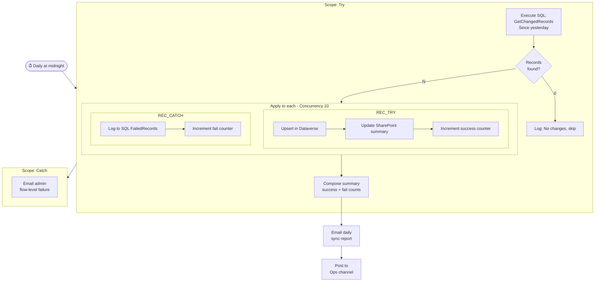

# Real-World Example: Data Sync Pipeline

<span class="badge badge-green">Complete Example</span> <span class="badge badge-purple">SQL + Dataverse + SharePoint</span>

**Scenario:** Every night at midnight, sync new/modified records from SQL Server (source of truth) into Dataverse and update a SharePoint summary list. Handle errors per-record without stopping the whole batch.

---

## Architecture



---

## SQL Setup

### Source query stored procedure

```sql
CREATE PROCEDURE GetChangedRecords
  @Since DATETIME2
AS
BEGIN
  SET NOCOUNT ON;
  SELECT
    r.Id,
    r.ExternalId,
    r.CustomerName,
    r.Email,
    r.ProductCode,
    r.Quantity,
    r.UnitPrice,
    r.TotalAmount,
    r.Status,
    r.LastModified,
    c.Region,
    c.SalesRep
  FROM Records r
  JOIN Customers c ON r.CustomerId = c.Id
  WHERE r.LastModified >= @Since
    AND r.Status IN ('Active', 'Pending', 'Closed')
  ORDER BY r.LastModified;
END;

-- Failed records log table:
CREATE TABLE FailedSyncRecords (
  Id          INT IDENTITY PRIMARY KEY,
  RecordId    INT,
  ErrorMsg    NVARCHAR(MAX),
  FailedAt    DATETIME2 DEFAULT GETUTCDATE(),
  BatchDate   DATE
);
```

---

## Flow Step-by-Step

### 1. Initialize counters

```
Initialize: successCount  (Integer, 0)
Initialize: failCount     (Integer, 0)
Initialize: batchDate     (String, formatDateTime(utcNow(), 'yyyy-MM-dd'))
```

### 2. Execute SQL — Get changed records

```json
Action: Execute stored procedure (V2)
Procedure: GetChangedRecords
Parameters:
  @Since: @{addDays(startOfDay(utcNow()), -1)}    ← yesterday midnight
```

Access rows: `body('Execute_stored_procedure')?['ResultSets']?['Table1']`

### 3. Check if records exist

```
Compose: recordCount
@{length(body('Execute_stored_procedure')?['ResultSets']?['Table1'])}

Condition: recordCount equals 0
  Yes → Log "No changes" + Terminate (Succeeded)
```

### 4. Apply to each — with concurrency 10

```
From: @{body('Execute_stored_procedure')?['ResultSets']?['Table1']}
Settings → Concurrency: On → Degree: 10
```

> ⚠️ With concurrency > 1, we cannot use variables inside the loop. We use Scope's `result()` after the loop instead.

**Inside each iteration — Scope: Record Try**

```json
Action: Upsert a row (Dataverse)
Table:  cr_SalesRecords
Row ID: @{items('Apply_to_each')?['ExternalId']}
Row:
{
  "cr_customerName":  "@{items('Apply_to_each')?['CustomerName']}",
  "cr_email":         "@{items('Apply_to_each')?['Email']}",
  "cr_productCode":   "@{items('Apply_to_each')?['ProductCode']}",
  "cr_quantity":      @{items('Apply_to_each')?['Quantity']},
  "cr_unitprice":     @{items('Apply_to_each')?['UnitPrice']},
  "cr_total":         @{items('Apply_to_each')?['TotalAmount']},
  "cr_status":        "@{items('Apply_to_each')?['Status']}",
  "cr_region":        "@{items('Apply_to_each')?['Region']}",
  "cr_salesrep":      "@{items('Apply_to_each')?['SalesRep']}",
  "cr_lastsyncdate":  "@{utcNow()}"
}
```

**Scope: Record Catch (run after Record Try fails)**

```json
Action: Execute stored procedure (V2)
Procedure: LogFailedRecord
Parameters:
  @RecordId: @{items('Apply_to_each')?['Id']}
  @ErrorMsg: @{result('Scope_Record_Try')?[0]?['error']?['message']}
  @BatchDate: @{outputs('Compose_batchDate')}
```

### 5. After the loop — count results using Filter array

Since we can't use variables inside the concurrent loop, use `result()` on the loop scope:

```
# Count successful iterations:
Compose: successCount
@{length(
  filter(
    result('Apply_to_each'),
    @{equals(item()?['status'], 'Succeeded')}
  )
)}

# Count failed:
Compose: failCount
@{length(
  filter(
    result('Apply_to_each'),
    @{equals(item()?['status'], 'Failed')}
  )
)}
```

### 6. Send daily sync report

```
Action: Send an email
To:      ops-team@company.com
Subject: 🔄 Daily Sync Report — @{outputs('Compose_batchDate')}
Body:

<h2>Daily Data Sync Report</h2>
<p><b>Date:</b> @{outputs('Compose_batchDate')}</p>

<table>
  <tr style="background:#dcfce7"><td><b>✅ Successful</b></td><td>@{outputs('Compose_successCount')}</td></tr>
  <tr style="background:#fee2e2"><td><b>❌ Failed</b></td><td>@{outputs('Compose_failCount')}</td></tr>
  <tr><td><b>Total</b></td><td>@{outputs('Compose_recordCount')}</td></tr>
</table>

@{if(greater(int(outputs('Compose_failCount')), 0),
  '<p style="color:red">⚠️ Some records failed — check FailedSyncRecords table.</p>',
  '<p style="color:green">All records synced successfully.</p>'
)}
```

---

## Key Design Decisions

| Decision | Why |
|----------|-----|
| Concurrency 10 | 10× faster than sequential; safe for Dataverse throttle limits |
| Per-record Try/Catch | One bad record doesn't stop the entire batch |
| Upsert instead of check+create | Atomic, idempotent, handles duplicates automatically |
| SQL for failed record log | Queryable, can feed a monitoring dashboard |
| `result()` for counting | Works with concurrent loops; variables don't |
| Stored procedure for data fetch | Parameterized = secure; optimized = fast |

---

## Expected Performance

| Records | Concurrency 1 | Concurrency 10 |
|---------|-------------|----------------|
| 100 | ~5 min | ~35 sec |
| 1,000 | ~50 min | ~6 min |
| 5,000 | ~4 hrs | ~35 min |

For 5,000+ records nightly, consider running this as a chunked flow or using Dataverse bulk import APIs.
