# Real-World Example: Employee Onboarding

<span class="badge badge-green">Complete Example</span> <span class="badge badge-blue">SharePoint + Teams + Dataverse</span>

**Scenario:** When HR adds a new employee record in SharePoint, automatically set up their accounts, send welcome communications, and assign onboarding tasks.

---

## Overview

```mermaid
flowchart TD
    T([📋 SharePoint: New item in\nEmployees list]) --> VALID{Required fields\npresent?}
    VALID -->|No| TERM[Terminate - Failed\nLog validation error]
    VALID -->|Yes| SCOPE_TRY

    subgraph SCOPE_TRY [🔵 Scope: Try]
      GREET[Post welcome message\nto Teams HR channel]
      GREET --> M365[Send welcome email\nvia Outlook]
      M365 --> DV[Create record in\nDataverse - OnboardingTasks]
      DV --> TASKS[Create 5 onboarding tasks\nin SharePoint Tasks list]
      TASKS --> NOTIF[Notify manager\nvia Teams Adaptive Card]
      NOTIF --> UPD[Update employee record:\nStatus = Onboarding Started]
    end

    SCOPE_TRY -->|Fail| SCOPE_CATCH

    subgraph SCOPE_CATCH [🔴 Scope: Catch]
      LOG[Log error to SharePoint\nErrorLog list]
      LOG --> ALERT[Email IT admin\nwith error details]
    end
```



---

## Connectors Used

| Connector | Purpose |
|-----------|---------|
| SharePoint | Trigger, create tasks, update employee record |
| Microsoft Teams | Welcome message, manager notification |
| Outlook | Welcome email |
| Microsoft Dataverse | Onboarding task tracking |

---

## Flow Step by Step

### 1. Trigger — SharePoint item created

```
Trigger: When an item is created
Site:    https://company.sharepoint.com/sites/HR
List:    Employees
```

Trigger outputs used:
- `triggerBody()?['Title']` — Employee full name
- `triggerBody()?['Email']` — Employee email
- `triggerBody()?['Department']` — Department
- `triggerBody()?['StartDate']` — Start date
- `triggerBody()?['Manager/Email']` — Manager's email
- `triggerBody()?['ID']` — SharePoint item ID

---

### 2. Validate required fields

```
Condition (Advanced mode):
@{and(
  not(empty(triggerBody()?['Email'])),
  not(empty(triggerBody()?['Title'])),
  not(empty(triggerBody()?['Manager/Email']))
)}

If No → Terminate (Failed, "Missing required fields")
```

---

### 3. Post to HR Teams channel

```json
Action: Post message in a chat or channel
Post as: Flow bot
Post in: Channel
Team:    HR Team
Channel: General
Message:
👋 **Welcome @{triggerBody()?['Title']}!**

📧 Email: @{triggerBody()?['Email']}
🏢 Department: @{triggerBody()?['Department']}
📅 Start date: @{formatDateTime(triggerBody()?['StartDate'], 'MMMM d, yyyy')}
👤 Manager: @{triggerBody()?['Manager/DisplayName']}
```

---

### 4. Send welcome email

```
Action: Send an email (V2)
To:      @{triggerBody()?['Email']}
Subject: Welcome to [Company], @{first(split(triggerBody()?['Title'], ' '))}! 🎉
Body:    (HTML template — see below)
```

**HTML email body:**

```html
<div style="font-family: Segoe UI, sans-serif; max-width: 600px;">
  <h1 style="color: #0078d4;">Welcome aboard, @{first(split(triggerBody()?['Title'], ' '))}! 🎉</h1>
  <p>We're thrilled to have you join the <strong>@{triggerBody()?['Department']}</strong> team.</p>

  <h3>Your first steps:</h3>
  <ol>
    <li>Complete your profile in the HR portal</li>
    <li>Connect with your manager, @{triggerBody()?['Manager/DisplayName']}</li>
    <li>Complete the mandatory security training (link below)</li>
    <li>Review the company handbook</li>
  </ol>

  <p>Your onboarding checklist has been created in SharePoint. You'll receive task reminders over the next 30 days.</p>

  <p>Start date: <strong>@{formatDateTime(triggerBody()?['StartDate'], 'dddd, MMMM d, yyyy')}</strong></p>

  <p style="color: #666;">Questions? Contact HR at hr@company.com</p>
</div>
```

---

### 5. Create Dataverse onboarding record

```json
Action: Add a new row
Table:  OnboardingRecords
Row:
{
  "cr_employeename":  "@{triggerBody()?['Title']}",
  "cr_email":         "@{triggerBody()?['Email']}",
  "cr_startdate":     "@{triggerBody()?['StartDate']}",
  "cr_department":    "@{triggerBody()?['Department']}",
  "cr_status":        100000000,  // Enum: In Progress
  "cr_spitemid":      "@{triggerBody()?['ID']}"
}
```

---

### 6. Create onboarding tasks in SharePoint

Use **`Apply to each`** on a static array of task definitions:

```json
From:
[
  {"title": "Complete HR paperwork",          "daysOffset": 0,  "owner": "HR"},
  {"title": "IT equipment setup",             "daysOffset": 1,  "owner": "IT"},
  {"title": "Security training",              "daysOffset": 3,  "owner": "Employee"},
  {"title": "Meet with manager 1:1",          "daysOffset": 5,  "owner": "Manager"},
  {"title": "30-day check-in with HR",        "daysOffset": 30, "owner": "HR"}
]
```

Inside the loop:
```json
Action: Create item
Site:    HR site
List:    OnboardingTasks
Title:   @{items('Apply_to_each')?['title']}
AssignedTo: @{if(
              equals(items('Apply_to_each')?['owner'], 'Employee'),
              triggerBody()?['Email'],
              if(equals(items('Apply_to_each')?['owner'], 'Manager'),
                 triggerBody()?['Manager/Email'],
                 'hr@company.com')
            )}
DueDate: @{addDays(triggerBody()?['StartDate'], items('Apply_to_each')?['daysOffset'])}
LinkedEmployee: @{triggerBody()?['ID']}
```

---

### 7. Notify manager with Adaptive Card

```json
Action: Post adaptive card and wait for a response
Post as: Flow bot
Post in: Chat with Flow bot
Recipient: @{triggerBody()?['Manager/Email']}
Adaptive Card:
{
  "$schema": "http://adaptivecards.io/schemas/adaptive-card.json",
  "type": "AdaptiveCard",
  "version": "1.5",
  "body": [
    { "type": "TextBlock", "text": "👋 New Team Member!", "weight": "Bolder", "size": "Large" },
    { "type": "FactSet", "facts": [
      { "title": "Name:",       "value": "@{triggerBody()?['Title']}" },
      { "title": "Email:",      "value": "@{triggerBody()?['Email']}" },
      { "title": "Start date:", "value": "@{formatDateTime(triggerBody()?['StartDate'], 'MMMM d, yyyy')}" }
    ]},
    { "type": "TextBlock", "text": "Please acknowledge you are aware of their start." }
  ],
  "actions": [
    { "type": "Action.Submit", "title": "✅ Acknowledged", "data": { "action": "ack" } }
  ]
}
```

---

### 8. Update employee record

```json
Action: Update item
Site: HR site
List: Employees
Id:   @{triggerBody()?['ID']}
OnboardingStatus: Onboarding Started
OnboardingDate:   @{utcNow()}
```

---

## Error Handling (Catch Scope)

```json
Scope: Catch
  ┌─ Compose: errorDetails
  │   @{result('Try')?[0]?['error']?['message']}
  │
  ├─ Create item in ErrorLog list:
  │   FlowName:     Employee Onboarding
  │   EmployeeId:   @{triggerBody()?['ID']}
  │   ErrorMessage: @{outputs('Compose_errorDetails')}
  │   OccurredAt:   @{utcNow()}
  │
  └─ Send email to IT admin:
      Subject: ⚠️ Onboarding Flow Failed for @{triggerBody()?['Title']}
      Body:    @{outputs('Compose_errorDetails')}

  └─ Terminate (Failed)
```

---

## Outcome

After the flow runs:
- ✅ HR channel notified in Teams
- ✅ Welcome email sent to new employee
- ✅ 5 onboarding tasks created with correct assignees and due dates
- ✅ Manager acknowledged via Teams card
- ✅ Dataverse record for audit trail
- ✅ Employee status updated in SharePoint
- ✅ Error handling with full logging
