# Real-World Example: IT Ticket Automation

<span class="badge badge-green">Complete Example</span> <span class="badge badge-blue">Teams + Azure DevOps + SQL</span>

**Scenario:** Users type `!ticket` in a Teams channel. Power Automate catches it, creates an Azure DevOps work item, logs it to SQL, sends a confirmation, and auto-assigns based on category.

---

## Architecture

```mermaid
flowchart TD
    T([💬 Teams: New channel message]) --> CHECK{Contains '!ticket'?}
    CHECK -->|No| IGNORE[Ignore - Terminate]
    CHECK -->|Yes| PARSE[Parse ticket details\nfrom message]
    PARSE --> CATEG[Determine category\nfrom keywords]
    CATEG --> ADO[Create Azure DevOps\nwork item]
    ADO --> SQL[Log to SQL\nIT_Tickets table]
    SQL --> REPLY[Reply in Teams\n✅ Ticket created - ID: #123]
    REPLY --> ASSIGN[Post to assignee\nin Teams DM]
    ASSIGN --> SCHED[Schedule follow-up\nreminder in 48 hours]
```



---

## Message Format

Users post in the `#it-support` channel:

```
!ticket
Category: Hardware
Priority: High
Description: My laptop screen is cracked
```

---

## Step-by-Step

### 1. Trigger

```
Trigger: When a new channel message is added
Team:    IT Support
Channel: it-support
```

### 2. Check for the !ticket keyword

```
Condition (Advanced):
startsWith(triggerBody()?['body/content'], '!ticket')

If No → Terminate (Succeeded)   ← silent ignore, not an error
```

### 3. Parse the message — Extract fields

```
# Extract Category
Action: Compose (category)
@{
  if(contains(toLower(triggerBody()?['body/content']), 'hardware'), 'Hardware',
  if(contains(toLower(triggerBody()?['body/content']), 'software'), 'Software',
  if(contains(toLower(triggerBody()?['body/content']), 'network'), 'Network',
  if(contains(toLower(triggerBody()?['body/content']), 'access'), 'Access',
  'General'))))
}

# Extract Priority (look for High/Medium/Low in message)
Action: Compose (priority)
@{
  if(contains(toLower(triggerBody()?['body/content']), 'high'), 'High',
  if(contains(toLower(triggerBody()?['body/content']), 'low'), 'Low',
  'Medium'))
}

# Extract Description (text after "Description:")
Action: Compose (description)
@{
  if(
    contains(triggerBody()?['body/content'], 'Description:'),
    trim(last(split(triggerBody()?['body/content'], 'Description:'))),
    'No description provided'
  )
}
```

### 4. Auto-assign based on category

```
# Build assignee map via Switch
Switch: @{outputs('Compose_category')}
  Hardware → assignee = hardware-team@company.com
  Software → assignee = software-team@company.com
  Network  → assignee = network-team@company.com
  Access   → assignee = security-team@company.com
  Default  → assignee = it-general@company.com
```

### 5. Create Azure DevOps work item

```json
Action: Create a work item
Organization: my-org
Project:      IT Support
Type:         Task
Title:        [IT Ticket] @{outputs('Compose_category')} - @{triggerBody()?['from/name']}
Description:  **Reporter:** @{triggerBody()?['from/name']}
              **Channel:** #it-support
              **Teams Message ID:** @{triggerBody()?['id']}

              @{outputs('Compose_description')}

Priority:     @{if(equals(outputs('Compose_priority'), 'High'), 1, if(equals(outputs('Compose_priority'), 'Medium'), 2, 3))}
Tags:         teams-ticket; @{toLower(outputs('Compose_category'))}
AssignedTo:   @{variables('assignee')}
```

Save the returned `ID`:
```
variables('workItemId') = body('Create_a_work_item')?['id']
```

### 6. Log to SQL Server

```sql
-- SQL table:
CREATE TABLE IT_Tickets (
  Id          INT IDENTITY PRIMARY KEY,
  AdoId       INT,
  Reporter    NVARCHAR(200),
  Category    NVARCHAR(50),
  Priority    NVARCHAR(20),
  Description NTEXT,
  Status      NVARCHAR(50) DEFAULT 'Open',
  CreatedAt   DATETIME2 DEFAULT GETUTCDATE(),
  TeamsLink   NVARCHAR(500)
)
```

```json
Action: Execute stored procedure (V2)
Procedure: InsertITTicket
Parameters:
  @AdoId:       @{variables('workItemId')}
  @Reporter:    @{triggerBody()?['from/name']}
  @Category:    @{outputs('Compose_category')}
  @Priority:    @{outputs('Compose_priority')}
  @Description: @{outputs('Compose_description')}
  @TeamsLink:   @{triggerBody()?['webUrl']}
```

### 7. Reply in Teams channel

```json
Action: Reply with a message in a channel
Team:       IT Support
Channel:    it-support
Message ID: @{triggerBody()?['id']}   ← reply to the original message

Message:
✅ **Ticket created!**

| Field | Value |
|-------|-------|
| Ticket ID | **#@{variables('workItemId')}** |
| Category  | @{outputs('Compose_category')} |
| Priority  | @{outputs('Compose_priority')} |
| Assigned  | @{variables('assignee')} |

Track your ticket: [Azure DevOps](https://dev.azure.com/my-org/IT-Support/_workitems/edit/@{variables('workItemId')})
```

### 8. DM the assignee

```json
Action: Post message in a chat or channel
Post as: Flow bot
Post in: Chat
Recipient: @{variables('assignee')}
Message:
🎫 **New ticket assigned to you**

**ID:** #@{variables('workItemId')}
**Category:** @{outputs('Compose_category')}
**Priority:** @{outputs('Compose_priority')}
**Reporter:** @{triggerBody()?['from/name']}
**Description:** @{outputs('Compose_description')}

[Open in ADO](https://dev.azure.com/my-org/IT-Support/_workitems/edit/@{variables('workItemId')})
```

### 9. Schedule a follow-up (48-hour reminder)

```
Action: Delay until
Timestamp: @{addHours(utcNow(), 48)}

Then:
Action: Execute stored procedure (GetTicketStatus)
If status is still 'Open':
  Post reminder in Teams: ⏰ Reminder - ticket #@{workItemId} still open
```

---

## What This Flow Covers

| Feature | Implementation |
|---------|---------------|
| Natural language parsing | `contains()` + `if()` expressions |
| Auto-classification | Switch on category |
| Multi-system integration | Teams + ADO + SQL |
| Direct reply | `Reply with a message` (threaded) |
| DM notification | Chat with Flow bot |
| Audit trail | SQL Server table |
| Scheduled follow-up | Delay until |
