# Real-World Example: Automated Weekly Report

<span class="badge badge-green">Complete Example</span> <span class="badge badge-blue">SharePoint + Excel + Outlook</span>

**Scenario:** Every Friday at 4 PM, generate a weekly summary of open tasks from SharePoint, create an Excel report, and email it to managers with an HTML summary table.

---

## Flow Architecture

```mermaid
flowchart TD
    T([⏰ Scheduled: Every Friday\n4:00 PM UTC+3]) --> GI[Get SharePoint items\nfilter: this week, Status=Open]
    GI --> COUNT[Compose: item count]
    COUNT --> COND{Any items?}
    COND -->|No| EMAIL_EMPTY[Email: No open tasks this week]
    COND -->|Yes| SEL[Select: reshape fields]
    SEL --> SEL2[Select: high-priority only]
    SEL2 --> HTML[Create HTML table]
    HTML --> CSV[Create CSV table]
    CSV --> SAVE[Create file in OneDrive\nWeekly-Report-YYYY-MM-DD.csv]
    SAVE --> EMAIL[Send email with\nHTML + CSV attachment]
    EMAIL --> TEAMS[Post summary\nto management channel]
```



---

## 1. Trigger — Scheduled

```
Trigger: Recurrence
Frequency: Week
Interval:  1
On these days: Friday
At these hours: 13          ← 1 PM UTC = 4 PM Turkey
At these minutes: 0
Time zone: UTC
```

> 💡 Power Automate recurrence uses UTC. 4 PM Turkey Standard Time = 1 PM UTC.

---

## 2. Get This Week's Open Tasks

```json
Action: Get items
Site:         https://company.sharepoint.com/sites/Operations
List:         Tasks
Filter query: Status eq 'Open' and Modified ge '@{startOfWeek(utcNow())}'
Top count:    500
Select:       Id,Title,AssignedTo/DisplayName,Priority,DueDate,Status,Department
Expand:       AssignedTo
Order by:     Priority asc
```

---

## 3. Count and Check

```
Compose: totalCount
@{length(body('Get_items')?['value'])}

Condition: length(body('Get_items')?['value']) equals 0
  Yes → Send "no tasks" email, terminate
```

---

## 4. Select — Reshape Fields

```json
Action: Select
From:  @{body('Get_items')?['value']}
Map:
{
  "ID":         "@{item()?['ID']}",
  "Title":      "@{item()?['Title']}",
  "Assignee":   "@{item()?['AssignedTo']?['DisplayName']}",
  "Priority":   "@{item()?['Priority']}",
  "Department": "@{item()?['Department']}",
  "DueDate":    "@{formatDateTime(item()?['DueDate'], 'yyyy-MM-dd')}",
  "Overdue":    "@{if(less(item()?['DueDate'], utcNow()), 'YES', 'No')}"
}
```

---

## 5. Filter High-Priority Items

```json
Action: Filter array
From:      @{body('Select')}
Condition: @{equals(item()?['Priority'], '1 - High')}

Compose: highPriorityCount
@{length(body('Filter_array'))}
```

---

## 6. Create HTML Table

```json
Action: Create HTML table
From:    @{body('Select')}
Columns: Custom
  ID         → @{item()?['ID']}
  Title      → @{item()?['Title']}
  Assignee   → @{item()?['Assignee']}
  Priority   → @{item()?['Priority']}
  Department → @{item()?['Department']}
  Due Date   → @{item()?['DueDate']}
  Overdue    → @{item()?['Overdue']}
```

---

## 7. Create CSV File

```json
Action: Create CSV table
From: @{body('Select')}

Action: Create file
Site path: /Reports
File name: Weekly-Report-@{formatDateTime(utcNow(), 'yyyy-MM-dd')}.csv
File content: @{base64ToBinary(base64(body('Create_CSV_table')))}
```

---

## 8. Send Email Report

```
To:      managers-group@company.com
CC:      operations@company.com
Subject: 📊 Weekly Task Report — @{formatDateTime(utcNow(), 'MMMM d, yyyy')}
Body:    (HTML — see below)
Attachments:
  Name:    Weekly-Report-@{formatDateTime(utcNow(), 'yyyy-MM-dd')}.csv
  Content: @{base64(body('Create_CSV_table'))}
```

**HTML email body:**

```html
<div style="font-family: Segoe UI; max-width: 700px;">
  <h2 style="color: #0078d4;">📊 Weekly Operations Report</h2>
  <p><strong>Week ending:</strong> @{formatDateTime(utcNow(), 'MMMM d, yyyy')}</p>

  <table style="border-collapse:collapse; margin: 10px 0;">
    <tr style="background:#0078d4; color:#fff;">
      <td style="padding:8px 16px;"><b>Total Open Tasks</b></td>
      <td style="padding:8px 16px; font-size:1.4em;"><b>@{outputs('Compose_totalCount')}</b></td>
    </tr>
    <tr style="background:#fff3cd;">
      <td style="padding:8px 16px;"><b>High Priority</b></td>
      <td style="padding:8px 16px; font-size:1.4em; color:#856404;"><b>@{outputs('Compose_highPriorityCount')}</b></td>
    </tr>
  </table>

  <h3>All Open Tasks:</h3>
  @{body('Create_HTML_table')}

  <p style="color:#666; font-size:0.85em;">
    Generated automatically by Power Automate on @{formatDateTime(utcNow(), 'dddd, MMMM d, yyyy')} at @{convertTimeZone(utcNow(), 'UTC', 'Turkey Standard Time', 'HH:mm')} (Turkey time).
    Full CSV attached.
  </p>
</div>
```

---

## 9. Post to Teams Management Channel

```
Action: Post message in a chat or channel
Team:    Management
Channel: Operations
Message:
📊 **Weekly Report Ready**

| Metric | Count |
|--------|-------|
| Total Open Tasks  | **@{outputs('Compose_totalCount')}** |
| High Priority     | ⚠️ **@{outputs('Compose_highPriorityCount')}** |

📎 Full report emailed to managers.
📁 [Download CSV](https://company.sharepoint.com/sites/Operations/Reports/Weekly-Report-@{formatDateTime(utcNow(), 'yyyy-MM-dd')}.csv)
```

---

## Outcome

Every Friday at 4 PM Turkey time:
- ✅ Fetches all open tasks from this week
- ✅ Calculates statistics (total, high-priority, overdue)
- ✅ Generates CSV report saved to SharePoint
- ✅ Sends branded HTML email with attached CSV
- ✅ Posts a summary to Teams management channel
- ✅ If no tasks: sends a "clear week" notification instead

**Total flow actions:** ~15 | **Run time:** < 30 seconds
