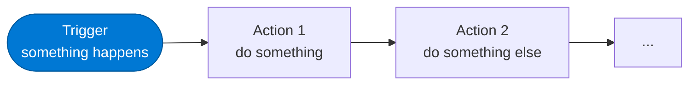

# Getting Started with Power Automate

<span class="badge badge-blue">Beginner</span>

Power Automate is Microsoft's cloud-based automation platform. It connects your apps and services to automate repetitive tasks — without writing code.

---

## What You'll Learn Here

| Page | What it covers |
|------|---------------|
| [What is Power Automate?](getting-started/what-is-pa) | Overview, flow types, licensing |
| [Triggers vs Actions](getting-started/triggers-vs-actions) | The core building blocks of every flow |
| [Your First Flow](getting-started/first-flow) | Step-by-step: SharePoint → Teams notification |
| [Interface Overview](getting-started/interface) | Canvas, designer panels, run history |
| [Connections & Auth](getting-started/connections) | Setting up and managing connector credentials |

---

## The 3-Minute Summary



1. **Trigger** — the event that starts your flow (e.g. a file is uploaded, an email arrives, a timer fires)
2. **Actions** — steps the flow takes in response (send a Teams message, create a record, call an API)
3. **Dynamic content** — data from earlier steps flows into later ones automatically
4. **Conditions & loops** — branch and repeat based on data

---

## Flow Types

| Type | Description | Use case |
|------|-------------|----------|
| **Automated cloud flow** | Triggered by an event | "When X happens, do Y" |
| **Scheduled cloud flow** | Runs on a timer | "Every Monday at 9am, do Y" |
| **Instant cloud flow** | Triggered manually or from PowerApps | Button press or app integration |
| **Desktop flow** | Automates local desktop/web apps | Legacy system automation (RPA) |
| **Business process flow** | Guided steps for humans | Multi-stage approvals |

---

## Prerequisites

- Microsoft 365 account
- Power Automate licence (most M365 plans include standard connectors)
- For premium connectors (SQL, HTTP, Dataverse): Power Automate Premium licence

---

## Recommended Learning Path

```
1. Triggers vs Actions     ← understand the model
2. Your First Flow         ← hands-on in 10 minutes
3. Interface Overview      ← learn the designer
4. Connections & Auth      ← connect your services
5. Control actions         ← add conditions and loops
6. Expressions             ← unlock the real power
7. Patterns                ← production-quality flows
```

**Next:** [Triggers vs Actions →](getting-started/triggers-vs-actions)
