# Your First Flow — Step by Step

<span class="badge badge-green">Hands-on</span> <span class="badge badge-blue">Beginner</span>

We'll build a simple but real flow: **"When a file is uploaded to SharePoint, send a Teams notification."**

---

## Prerequisites

- Microsoft 365 account with Power Automate access
- A SharePoint site with a document library
- Access to Microsoft Teams

---

## Step-by-step Walkthrough

<!-- tabs:start -->

#### **Step 1 — Open Power Automate**

1. Go to [make.powerautomate.com](https://make.powerautomate.com)
2. Sign in with your Microsoft 365 account
3. Click **+ Create** in the left sidebar
4. Choose **Automated cloud flow**

#### **Step 2 — Name and Choose Trigger**

1. Give the flow a name: `Notify Team on File Upload`
2. In the search box, type `SharePoint`
3. Select **"When a file is created (properties only)"**
4. Click **Create**

#### **Step 3 — Configure the Trigger**

Fill in the trigger settings:

| Field | Value |
|-------|-------|
| Site Address | Your SharePoint site URL |
| Library Name | Your document library (e.g., `Documents`) |

> 💡 Use the **dropdown** — don't type the URL manually. The connector will fetch your available sites.

#### **Step 4 — Add an Action**

1. Click **+ New step**
2. Search for `Microsoft Teams`
3. Select **"Post message in a chat or channel"**

Configure it:

| Field | Value |
|-------|-------|
| Post as | Flow bot |
| Post in | Channel |
| Team | Select your team |
| Channel | Select your channel |
| Message | See below |

**Message (with dynamic content):**
```
📁 New file uploaded!

Name: [Name - from trigger]
Uploaded by: [Created By DisplayName]
Link: [Link to item]
```

Use the **dynamic content panel** (lightning bolt icon) to insert the values in `[ ]` — these come from the trigger output.

#### **Step 5 — Save and Test**

1. Click **Save** (top right)
2. Click **Test** → Select **"Manually"** → **Test**
3. Go to your SharePoint library and upload a file
4. Check your Teams channel — the message should arrive within seconds!

<!-- tabs:end -->

---

## What Just Happened?

```mermaid
sequenceDiagram
    participant You
    participant SP as SharePoint
    participant PA as Power Automate
    participant Teams

    You->>SP: Upload file.docx
    SP->>PA: Trigger fires (event)
    PA->>PA: Read trigger outputs<br/>(file name, uploader, URL)
    PA->>Teams: Post message with file details
    Teams-->>You: 🔔 Notification in channel
```



---

## Improving the Flow

Now that your first flow works, here are ways to make it better:

### Add a Condition — only notify for certain file types

After the trigger, add a **Condition** action:

```
Expression:  endsWith(triggerOutputs()?['body/{FilenameWithExtension}'], '.pdf')
```

- **If Yes:** Post the Teams message
- **If No:** Do nothing (or post a different message)

### Add error handling with Scope

Wrap your Teams action in a **Scope**, then add a second Scope with "Configure run after → has failed" to catch errors and send yourself an email.

See [Error Handling pattern →](../patterns/error-handling)

### Use a child flow for reusability

If you want to send Teams notifications from multiple flows, extract the notification step into a [Child Flow →](../patterns/child-flows).

---

## Common First-Time Problems

| Problem | Cause | Fix |
|---------|-------|-----|
| Flow runs but no Teams message | Wrong Team/Channel selected | Re-check the dropdown selections |
| Trigger fires but no file name in message | Using wrong dynamic content | Use `Name` not `File identifier` |
| Flow never fires | Library path mismatch | Check Site Address exactly matches |
| "Connection invalid" error | Auth expired | Re-authenticate the connection |

---

**Next:** [Interface Overview →](interface)
