# Flow Types

Beginner

Power Automate offers several types of flows depending on whether you want things to happen **automatically**, **on a schedule**, or **with a human click**.

---

## Overview

```mermaid
graph TD
    PA[Power Automate] --> CF[☁️ Cloud Flows]
    PA --> DF[🖥️ Desktop Flows]
    PA --> BP[🔄 Business Process Flows]

    CF --> Auto[Automated]
    CF --> Instant[Instant / Button]
    CF --> Sched[Scheduled]

    DF --> Attended[Attended RPA]
    DF --> Unattended[Unattended RPA]
```

---

## Cloud Flows

Cloud flows run in the cloud — no local machine needed. They connect to online services via connectors.

### 1. Automated Cloud Flow

Fires **automatically** when an event happens in a connected service.

| Property | Value |
|----------|-------|
| Trigger | Event-based (push) |
| Human needed? | No |
| Runs on | Microsoft cloud |
| Example | "When a file is created in SharePoint" |

**Best for:** Reacting to events in real time — new emails, form submissions, file uploads, Teams messages.

---

### 2. Instant / Button Flow

Triggered **manually** — by a person pressing a button.

| Property | Value |
|----------|-------|
| Trigger | Manual (button push) |
| Human needed? | Yes, to start it |
| Runs on | Microsoft cloud |
| Example | "Send my status report" button in Teams |

**Best for:** On-demand actions — submitting a request, generating a report now, triggering a process mid-meeting.

> 💡 Button flows can accept **input** from the person running them (text, numbers, dates) — e.g., "What project is this for?"

---

### 3. Scheduled Cloud Flow

Runs **on a timer** — every hour, every Monday, once a day, etc.

| Property | Value |
|----------|-------|
| Trigger | Time-based (cron-like) |
| Human needed? | No |
| Runs on | Microsoft cloud |
| Example | "Every Friday at 4 PM, send a team summary" |

**Best for:** Recurring reports, data syncs, reminders, cleanup jobs.

> ⚠️ The minimum interval for scheduled flows is **1 minute** on standard plans.

---

## Desktop Flows (RPA)

Desktop flows use **Robotic Process Automation** — they literally control a computer's mouse and keyboard to automate legacy apps, SAP, thick-client software, or anything without an API.

### Attended RPA
A human is present and watching. The robot does the repetitive clicks while the user monitors.

### Unattended RPA
Runs without a human — typically on a virtual machine, overnight or on a schedule.

> 🔴 Unattended RPA requires a **Power Automate Process** license (per-flow).

---

## Business Process Flows

Guide users through a **multi-stage process** with defined steps — like a wizard. They live inside Dataverse / model-driven Power Apps.

**Example:** A "New Employee" business process flow with stages: *HR Intake → IT Setup → Manager Intro → Training Complete*.

---

## Comparison Table

| Feature | Automated | Instant | Scheduled | Desktop (RPA) | BPF |
|---------|-----------|---------|-----------|---------------|-----|
| Trigger | Event | Button | Timer | Trigger/Schedule | Manual |
| Cloud-only | ✅ | ✅ | ✅ | ❌ (needs PC) | ✅ |
| License needed | M365 | M365 | M365 | Premium/Process | Premium |
| Real-time | ✅ | ✅ | ❌ | Varies | ❌ |
| API required | ✅ | ✅ | ✅ | ❌ | ✅ |

---

## How to Choose

---

**Next:** [Your First Flow →](first-flow)
