# Triggers vs Actions

<span class="badge badge-blue">Beginner</span>

Understanding the difference between **triggers** and **actions** is the most fundamental concept in Power Automate.

---

## The Rule

> Every flow has **exactly one trigger** and **one or more actions**.

```mermaid
graph LR
    T([🔔 Trigger<br/>ONE per flow]) --> A1[Action 1]
    A1 --> A2[Action 2]
    A2 --> A3[Action N…]
    style T fill:#0078d4,color:#fff,stroke:#005a9e
```



---

## Triggers

A trigger is the **starting event**. The flow does nothing until the trigger fires.

### Trigger Categories

| Category | Examples | When it fires |
|----------|---------|--------------|
| **Event-based** | SharePoint item created, Email received | When the event happens |
| **Scheduled** | Recurrence, Sliding window | On a timer |
| **Manual** | Manually trigger a flow, PowerApps | When a user presses a button |
| **HTTP** | When an HTTP request is received | When a webhook call arrives |

### Trigger Outputs
After the trigger fires, it provides **outputs** — data about what happened. These become available as dynamic content in all actions below.

**Example — SharePoint "When an item is created" outputs:**

| Output | Description |
|--------|-------------|
| `ID` | The new item's ID |
| `Title` | The item's Title field |
| `Created` | Timestamp of creation |
| `Author/DisplayName` | Who created it |
| `_odata.etag` | Optimistic concurrency tag |

---

## Actions

An action is a **step the flow takes**. Actions run sequentially (top to bottom) by default.

### Action Categories

| Category | Examples |
|----------|---------|
| **Connector actions** | Send email, Create SharePoint item, Post Teams message |
| **Control actions** | Condition, Apply to each, Switch, Scope, Terminate |
| **Data actions** | Compose, Parse JSON, Filter array, Select |
| **Variable actions** | Initialize, Set, Increment, Append |

### Action Inputs and Outputs
- **Inputs** — you configure these (static text, dynamic content from earlier steps, or expressions)
- **Outputs** — data the action produces, available to all subsequent steps

---

## Run After — Controlling Order

By default, each action runs only if the previous one **succeeded**. You can change this:


Right-click any action → **Configure run after** to set:
- ✅ is successful
- ❌ has failed
- ⏱ has timed out
- ⏭ is skipped

This is how you build [error handling](../patterns/error-handling) in Power Automate.

---

## Parallel Branches

You can run multiple actions at the same time (in parallel) by clicking the **"+" in between** and choosing **"Add a parallel branch"**.

```
[Trigger]
    ├── [Send Email]      ← runs simultaneously
    └── [Post to Teams]   ← runs simultaneously
         ↓
    [Continue after both]
```

> ⚠️ Variables cannot be **read or written** inside parallel branches. Use `Compose` actions instead.
