# What is Power Automate?

Beginner

> **Power Automate** (formerly Microsoft Flow) is Microsoft's low-code automation platform. It lets you build automated workflows — called **flows** — that connect your apps and services to move data, trigger notifications, and automate repetitive tasks, all without writing traditional code.

---

## The Big Picture

Think of Power Automate as a **smart pipe** between your apps. When something happens in one place (a trigger), it automatically does something in another place (an action).

```mermaid
graph LR
    subgraph Triggers
      T1[📧 Email received]
      T2[📋 Form submitted]
      T3[⏰ Schedule]
      T4[📁 File created]
    end

    subgraph Power Automate
      PA[⚡ Flow Engine]
    end

    subgraph Actions
      A1[💬 Send Teams message]
      A2[📊 Update Excel]
      A3[📁 Save to SharePoint]
      A4[📩 Notify on mobile]
    end

    T1 --> PA
    T2 --> PA
    T3 --> PA
    T4 --> PA
    PA --> A1
    PA --> A2
    PA --> A3
    PA --> A4
```

---

## Real-World Examples

| Scenario | Trigger | Action |
|----------|---------|--------|
| Auto-save email attachments | New email with attachment | Save file to OneDrive |
| Approval for expense report | Form submitted | Send Teams card, await approval |
| Daily report | Every day at 8 AM | Read Excel, email summary |
| IT ticket from Teams | New Teams message with keyword | Create Azure DevOps work item |
| New employee setup | HR system record created | Create accounts, send welcome email |

---

## Key Concepts

### Trigger
Every flow starts with exactly **one trigger**. The trigger defines *what* starts the flow.

- **Automated trigger** — fires when an event happens (new email, new row in SharePoint, etc.)
- **Instant trigger** — you press a button manually (from mobile or Teams)
- **Scheduled trigger** — runs on a timer (every hour, every Monday, etc.)

### Action
An action is a **step** the flow takes after the trigger fires. You can chain as many actions as you need.

### Connector
A **connector** is a pre-built integration with a service (SharePoint, Teams, Gmail, Salesforce, etc.). Microsoft provides 1,000+ connectors. Each connector has triggers and actions.

### Connection
When you use a connector for the first time, you create a **connection** — this is where you authenticate with the service (sign in with your account). The connection stores the credentials securely.

---

## What Power Automate is NOT

| Misconception | Reality |
|--------------|---------|
| It's only for Microsoft apps | It has connectors for Google, Salesforce, Twitter, Slack, and custom REST APIs |
| You need to code | 90% of flows need zero code — expressions are optional |
| It's slow / unreliable | Cloud flows run in seconds; enterprise SLAs apply |
| It replaces Power Apps | They complement each other — Power Apps builds UIs, Power Automate builds backend logic |

---

## Where It Lives

You access Power Automate at **[make.powerautomate.com](https://make.powerautomate.com)** (sign in with your Microsoft 365 account).

It's also embedded in:
- **Microsoft Teams** → Apps → Power Automate
- **SharePoint** → Automate button on lists/libraries
- **Power Apps** — call flows from canvas apps
- **Power BI** — trigger alerts and flows from reports

---

## Licensing at a Glance

| Plan | Who it's for | Key limit |
|------|-------------|-----------|
| Microsoft 365 included | All M365 users | Standard connectors only |
| Power Automate Premium | Power users | Premium connectors (SAP, Salesforce…) |
| Power Automate Process | Unattended automation | Per-flow, not per-user |
| Power Automate Desktop | RPA (robot clicks) | Free for Windows 10/11 |

> 💡 Most SharePoint, Teams, Excel Online, and OneDrive connectors are **standard** — included with any Microsoft 365 subscription.

---

**Next:** [Flow Types →](flow-types)
