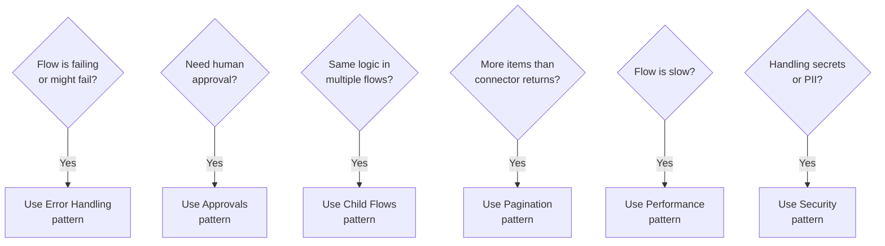

# Patterns & Best Practices

Architecture

Reusable design patterns that solve common Power Automate challenges. Learn these patterns once, apply them everywhere.

---

## Patterns in This Section

| Pattern | What it solves |
|---------|---------------|
| [Error Handling](error-handling) | Catch failures, log errors, alert admin |
| [Approval Workflows](approvals) | Request approvals, wait for response, route by outcome |
| [Child Flows](child-flows) | Reusable logic, maintainable architecture |
| [Pagination](pagination) | Handle large result sets beyond connector limits |
| [Performance](performance) | Speed up slow flows, reduce API calls |
| [Security](security) | Protect credentials, PII, and API endpoints |

---

## Pattern Selection Guide

---

## The "Always Apply" List

These three patterns should be in **every** production flow, no exceptions:

1. **[Error Handling](error-handling)** — Wrap main logic in a Try scope, add a Catch scope
2. **[Security](security)** — No hard-coded secrets, use Secure Inputs/Outputs
3. **[Performance](performance)** — Filter at the source, not in the flow
