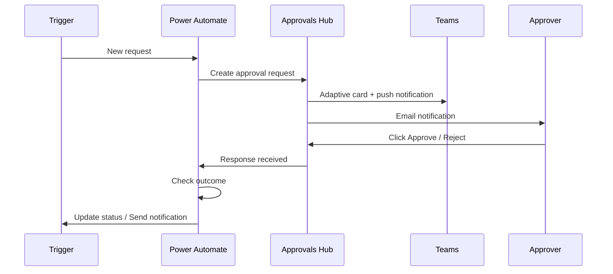
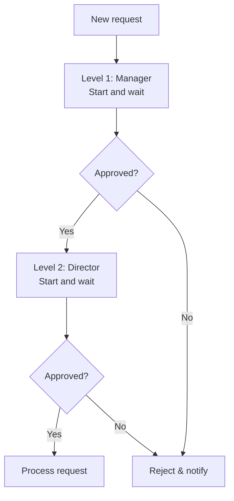
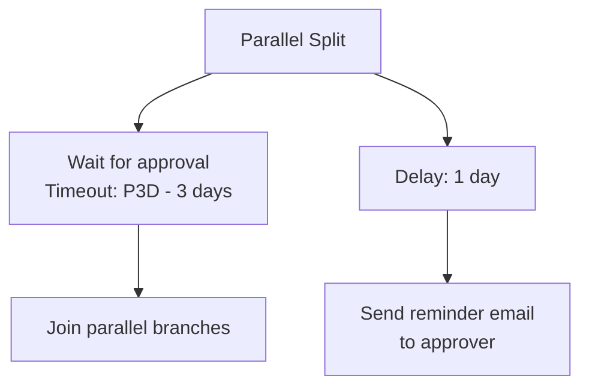

# Approval Workflows

<span class="badge badge-blue">Pattern</span>

Power Automate has a built-in **Approvals** connector that manages the full approval lifecycle — sending requests, waiting for responses, and routing based on outcomes.

---

## Approvals vs Adaptive Cards

| Method | Best for |
|--------|---------|
| **Approvals connector** | Standard approve/reject with automatic tracking, mobile push, and Approvals hub |
| **Teams Adaptive Card** | Custom forms, multiple inputs, branded UX |
| **Outlook Actionable Message** | Email-based approval with buttons |

---

## Basic Approval with the Approvals Connector



### The Actions

```
1. Action: Start and wait for an approval
   Approval type: Approve/Reject - First to respond
   Title:         Expense Approval - @{triggerBody()?['Title']}
   Assigned to:   manager@company.com
   Details:       Amount: @{triggerBody()?['Amount']}
                  Submitted by: @{triggerBody()?['Submitter']}
   Item link:     @{triggerBody()?['ItemUrl']}

2. Condition: outcome equals 'Approve'
   Yes → Update status to Approved, send confirmation
   No  → Update status to Rejected, send rejection email
```

---

## Approval Types

| Type | Behavior |
|------|----------|
| `Approve/Reject - First to respond` | First person to respond decides |
| `Approve/Reject - Everyone must approve` | All approvers must approve; any rejection = rejected |
| `Custom responses` | Define your own buttons (e.g., "Approve", "Reject", "Need more info") |

---

## Multi-Level Approval (Sequential)



---

## Parallel Approval (All Must Approve)

Use **"Approve/Reject - Everyone must approve"** and add multiple approvers:

```
Assigned to:
  manager@company.com;
  compliance@company.com;
  finance@company.com
```

All three must approve. If any one rejects, the overall outcome is "Reject".

---

## Reading the Response

After the approval action:

```
# Outcome: "Approve" or "Reject" (or custom response text)
outputs('Start_and_wait_for_an_approval')?['body/outcome']

# Approver's name
outputs('Start_and_wait_for_an_approval')?['body/responses'][0]['responder']['displayName']

# Approver's comments
outputs('Start_and_wait_for_an_approval')?['body/responses'][0]['comments']

# Response timestamp
outputs('Start_and_wait_for_an_approval')?['body/responses'][0]['requestDate']

# All responses (for multi-approver)
outputs('Start_and_wait_for_an_approval')?['body/responses']
```

---

## Approval with Custom Responses

```json
Approval type: Custom responses
Response options:
  - Approve
  - Reject
  - Request More Information

# Then use Switch on the outcome:
Switch: @{outputs('Start_and_wait')?['body/outcome']}
  Case "Approve":            → proceed
  Case "Reject":             → reject
  Case "Request More Info":  → email submitter, wait for update, restart approval
```

---

## Reminder / Escalation Pattern

Approvals can go stale. Use a parallel branch to handle this:



Or use the **timeout** on the approval action:
1. Settings on the approval action → Timeout → `P3D` (3 days ISO 8601)
2. In "Configure run after" of the next action, handle "has timed out" separately

---

## Delegated Approval (Out of Office)

Use the **Approvals connector** → **`Create an approval`** + **`Wait for an approval response`** (non-blocking version) to allow:
- Checking if the approver is OOO (via Outlook availability)
- Sending to a backup approver if no response in 24 hours

```
Action: Create an approval (non-blocking)
→ Save approval ID

Action: Delay 1 day

Action: Get approval (check if responded)
If not responded → Cancel + create new approval for backup
```

---

## Pro Tips

- Always include **item link** and **full details** in the approval — approvers shouldn't have to hunt for context.
- Use **"Custom responses"** when you need more than just approve/reject (e.g., "Partial Approve", "Defer").
- Store approval history in a **SharePoint list** or **Dataverse** for audit compliance.
- Set a **timeout** on every approval — unresponded requests block the flow run forever by default.
- Use the **Approvals Hub** (`approvals.microsoft.com`) to give approvers a central dashboard for all pending requests.
