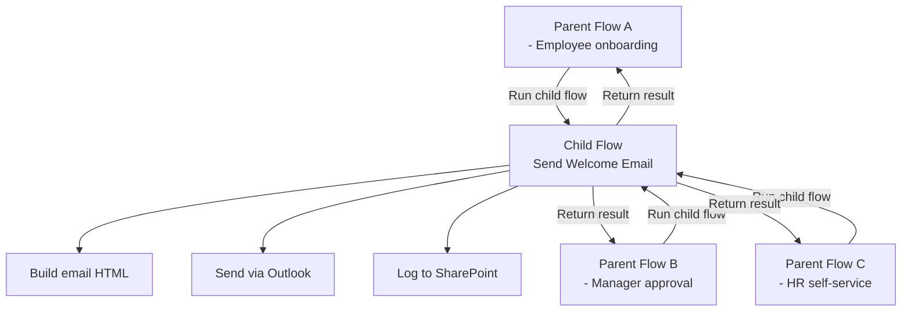

# Child Flows — Reusable Sub-flows

<span class="badge badge-blue">Pattern</span> <span class="badge badge-purple">Advanced</span>

Child flows (also called **sub-flows** or **called flows**) let you extract reusable logic into a separate flow and call it from multiple parent flows — like a function or method.

---

## Why Use Child Flows?

| Problem | Solution |
|---------|---------|
| Same 10 actions duplicated in 5 flows | Extract into 1 child flow, call from all 5 |
| Flow getting too large to read | Break into logical child flows |
| Shared business logic needs to change | Update in one place, all callers get the fix |
| Testing reusable logic | Test the child flow independently |

---

## Architecture



---

## Setting Up a Child Flow

### Step 1: Create the child flow

1. Create a new **Instant cloud flow** (triggered manually or "when called from another flow")
2. Trigger: **"Manually trigger a flow"** (this also enables calling it from another flow)

### Step 2: Define input parameters

In the trigger, add **inputs**:

| Input | Type |
|-------|------|
| `employeeEmail` | Text |
| `employeeName` | Text |
| `department` | Text |

### Step 3: Add actions

Add your reusable logic — send email, create item, post to Teams, etc.

### Step 4: Define outputs (return values)

Add a **`Respond to a PowerApp or flow`** action at the end:

| Output | Value |
|--------|-------|
| `status` | `success` |
| `createdItemId` | `@{outputs('Create_item')?['body/ID']}` |

---

## Calling the Child Flow from a Parent

In the parent flow:
1. Add action: **"Run a Child Flow"**
2. Select the child flow from the dropdown
3. Fill in the input parameters

```json
Action: Run a Child Flow
Child flow: Send Welcome Email
Inputs:
  employeeEmail: @{triggerBody()?['email']}
  employeeName:  @{triggerBody()?['name']}
  department:    @{triggerBody()?['department']}
```

Access the return value:
```
outputs('Run_a_Child_Flow')?['body/status']
outputs('Run_a_Child_Flow')?['body/createdItemId']
```

---

## Input / Output Types

| Type | Notes |
|------|-------|
| Text | Strings, numbers as string, JSON string |
| Yes/No | Boolean |
| Number | Integer or decimal |
| Date | Date/time value |
| Email | String with email validation |
| File | Binary file content |

> ⚠️ Child flows only run in the **same environment** as the parent. Cross-environment child flows are not supported.

---

## Common Child Flow Patterns

### Logging / Audit utility
```
Child flow: Log Event
Inputs: eventType, entityId, message, severity
Actions: Create item in SharePoint AuditLog list
```

### Notification hub
```
Child flow: Send Notification
Inputs: recipientEmail, subject, body, channel, teamId
Actions: If channel provided → post Teams message
         Else → send email
```

### Lookup / enrichment
```
Child flow: Get Employee Details
Input:  employeeEmail
Action: List Dataverse rows (filter by email)
Output: jobTitle, managerId, department, location
```

---

## Limitations

| Limitation | Workaround |
|-----------|------------|
| Must be in same environment | Use HTTP trigger + "When HTTP request received" for cross-env |
| Only "Instant" flows can be called | Cannot call scheduled or automated flows as children |
| No recursion | Avoid calling a flow that calls itself — infinite loop |
| Max nesting: ~5 levels | Deep nesting can cause timeout issues |

---

## Pro Tips

- Name child flows clearly: prefix with `[CHILD]` — e.g., `[CHILD] Send Approval Notification`.
- Put child flows in a **Solution** so they can be managed together with parent flows.
- Use child flows to **abstract connector-specific logic** — if you switch from Outlook to Teams for notifications, you only update the child flow.
- Test child flows directly by triggering them manually with test inputs before wiring up parents.
