# Error Handling — Try/Catch Pattern

<span class="badge badge-orange">Best Practice</span> <span class="badge badge-red">Production Must-Have</span>

Every production flow needs error handling. Here's how to build robust, fail-safe flows.

---

## The Problem

By default, if one action fails, the flow stops and everything after it is **skipped** — silently. You get a red ✗ in the run history but no notification, no log, no way to recover.

## The Solution: Scope + Configure Run After

```mermaid
graph TD
    TRY["🔵 Scope: Try\n(main actions)"]
    TRY -->|✅ Success| NEXT[Continue normally]
    TRY -->|❌ Fail| CATCH["🔴 Scope: Catch\n(error handling)"]
    CATCH --> LOG[Log error to SharePoint]
    CATCH --> NOTIF[Email / Teams alert]
    CATCH --> TERM[Terminate - Failed]
```



---

## Step-by-Step Setup

### 1. Create the Try Scope

Add a `Scope` action and name it **Try**. Put all your main actions inside it.

```
Scope: Try
  ├── Get SharePoint items
  ├── Apply to each
  │     ├── HTTP POST to API
  │     └── Update Dataverse row
  └── Send summary email
```

### 2. Create the Catch Scope

Add another `Scope` immediately after. Name it **Catch**.

Then configure it to run ONLY on failure:
1. Click `···` on the Catch scope
2. **Configure run after**
3. Uncheck ✅ "is successful"
4. Check ❌ "has failed" ✅
5. Check ⏱ "has timed out" ✅ (optional but recommended)

### 3. Add Error Handling Actions Inside Catch

```
Scope: Catch
  ├── Compose: Error Details
  │     @{result('Try')?[0]?['error']?['message']}
  ├── Create item in SharePoint (Error Log list)
  │     Title:   Flow Error - @{utcNow('yyyy-MM-dd HH:mm')}
  │     Error:   @{outputs('Compose_Error_Details')}
  │     FlowRun: @{workflow()?['run']?['name']}
  ├── Send email to admin
  └── Terminate (Status: Failed, Message: Error occurred)
```

---

## Accessing Error Information

Inside the Catch scope, use `result('Try')` to read what failed:

```
# Error message
result('Try')?[0]?['error']?['message']

# Error code
result('Try')?[0]?['error']?['code']

# Which action failed
result('Try')?[0]?['name']

# Status (Failed, TimedOut, Skipped)
result('Try')?[0]?['status']

# Full error as JSON string
string(result('Try'))
```

### Workflow context

```
# Flow name
workflow()?['tags']?['flowDisplayName']

# Run ID
workflow()?['run']?['name']

# Link to this specific run
concat(
  'https://make.powerautomate.com/environments/',
  workflow()?['tags']?['environmentName'],
  '/flows/',
  workflow()?['name'],
  '/runs/',
  workflow()?['run']?['name']
)
```

---

## Full Error Alert Email Template

```
Subject: ⚠️ Flow Error: @{workflow()?['tags']?['flowDisplayName']}

Body:
<h2>⚠️ Flow Execution Error</h2>

<table>
  <tr><td><b>Flow</b></td><td>@{workflow()?['tags']?['flowDisplayName']}</td></tr>
  <tr><td><b>Time</b></td><td>@{convertTimeZone(utcNow(), 'UTC', 'Turkey Standard Time', 'yyyy-MM-dd HH:mm')}</td></tr>
  <tr><td><b>Error</b></td><td>@{result('Try')?[0]?['error']?['message']}</td></tr>
  <tr><td><b>Run ID</b></td><td>@{workflow()?['run']?['name']}</td></tr>
</table>

<p><a href="@{concat('https://make.powerautomate.com/environments/', ...)}">View Run Details</a></p>
```

---

## Action-Level Error Handling

For individual actions (not the whole Scope), use **Configure run after** directly:

```
Action: Send email
  ↓
Action: On email success → log success   (run after: succeeded)
Action: On email failure → use alternate (run after: failed)
```

---

## Retry Policies

For transient errors (network blips, API rate limits), configure retries:

1. Click the action → `···` → **Settings**
2. **Retry Policy** → select type:

| Policy | Config | Best for |
|--------|--------|---------|
| None | — | Actions that must not retry (idempotency concerns) |
| Default | 4 retries, exponential | Most cases |
| Fixed | Every N seconds, up to X times | Predictable external APIs |
| Exponential | Increasing delays | Rate-limited APIs (Graph, SharePoint) |

```json
Retry policy: Exponential interval
Retry interval: PT5S  (5 seconds)
Maximum retries: 4
Minimum interval: PT5S
Maximum interval: PT1H
```

---

## Common Patterns

### Always-run cleanup

```
Scope: Finally (equivalent)
  Configure run after: is successful + has failed + has timed out + is skipped
  Actions: cleanup, release locks, update status
```

### Error log list in SharePoint

Create a SharePoint list `FlowErrorLog` with columns:
- `FlowName` (text)
- `ErrorMessage` (text, multi-line)
- `RunId` (text)
- `OccurredAt` (date/time)
- `Severity` (choice: High/Medium/Low)

Then in Catch:
```json
Action: Create item
  FlowName:     @{workflow()?['tags']?['flowDisplayName']}
  ErrorMessage: @{result('Try')?[0]?['error']?['message']}
  RunId:        @{workflow()?['run']?['name']}
  OccurredAt:   @{utcNow()}
  Severity:     High
```

---

## Pro Tips

- Every production flow should have a Try/Catch — no exceptions.
- Store error logs in **SharePoint** or **Dataverse** for searchable history.
- Include the **direct link to the run** in alert emails — it saves huge amounts of debugging time.
- Use **`Terminate` (status: Failed)** at the end of Catch so the run shows as ❌ in history, not ✅.
- For non-critical actions (logging, notifications), add individual retry policies rather than a full Scope.
