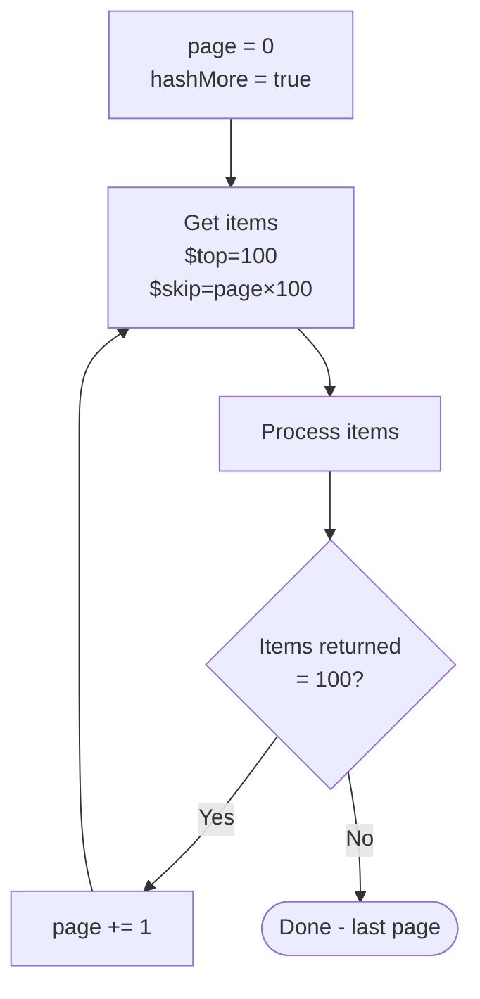

# Pagination

<span class="badge badge-orange">Performance</span>

Many connectors return paginated results — only the first N items, with a link to get the next page. Handle pagination properly or you'll miss data.

---

## Why Pagination Matters

| Connector | Default page size | Max without pagination |
|-----------|-----------------|----------------------|
| SharePoint Get items | 100 | 5,000 |
| Microsoft Graph | 100 | 100 |
| Dataverse List rows | 5,000 | 5,000 |
| Excel List rows | 256 | 256 |
| SQL Get rows | 128 | 128 |

If you have 500 SharePoint items and don't handle pagination, you only process the first 100.

---

## Option 1: Increase Page Size (Connector Setting)

For **SharePoint Get items** and similar actions:
1. Click the action → **Settings**
2. **Pagination: On**
3. Set **Threshold** to your desired max (up to 100,000 for SharePoint)

> ⚠️ This loads ALL items into memory at once. For very large lists (10,000+), this can cause timeout or memory issues. Use proper pagination loops instead.

---

## Option 2: OData Skip / Top (Client-side pagination)

For SharePoint / Graph:

```
# Page 1:
$top=100&$skip=0

# Page 2:
$top=100&$skip=100

# Page N:
$top=100&$skip=@{mul(variables('page'), 100)}
```

Combined with a `Do until` loop:



---

## Option 3: nextLink / @odata.nextLink

APIs following OData v4 return a `@odata.nextLink` URL when more pages exist:

```json
{
  "value": [...],
  "@odata.nextLink": "https://graph.microsoft.com/v1.0/users?$top=100&$skiptoken=abc123"
}
```

**Loop implementation:**

```
Initialize: nextUrl  = "https://graph.microsoft.com/v1.0/users?$top=100"
Initialize: allItems = []

Do until: nextUrl is empty

  HTTP GET nextUrl

  Append each item to allItems:
    Apply to each body('HTTP')?['value']:
      Append to array variable: allItems ← current item

  Set nextUrl = coalesce(body('HTTP')?['@odata.nextLink'], '')
```

---

## Option 4: SharePoint Specific — GetListItems with skiptoken

For lists over 5,000 items using SharePoint REST API:

```http
GET _api/web/lists/getbytitle('MyList')/items?$top=1000&$skiptoken=Paged%3DTRUE%26p_ID%3D1000
```

---

## Full Working Pagination Loop

```
// Variables initialized before the loop:
// nextUrl  = "https://graph.microsoft.com/v1.0/groups/GROUP_ID/members?$top=100"
// allUsers = []

Do until: @{empty(variables('nextUrl'))}
Limit count: 50   ← safety cap
Timeout: PT2H     ← safety timeout

  ┌─ HTTP GET @{variables('nextUrl')}
  │  Auth: Active Directory OAuth
  │
  ├─ Apply to each @{body('HTTP')?['value']}
  │    └─ Append to array variable: allUsers ← items('Apply_to_each')
  │
  └─ Set variable: nextUrl = @{coalesce(body('HTTP')?['@odata.nextLink'], '')}

// After loop: allUsers contains ALL members
```

---

## SQL Server Pagination

Use `OFFSET / FETCH` in a stored procedure:

```sql
CREATE PROCEDURE GetPagedData
  @PageSize   INT = 100,
  @PageNumber INT = 1    -- 1-based
AS
BEGIN
  SET NOCOUNT ON;
  SELECT * FROM Orders
  ORDER BY Id
  OFFSET (@PageNumber - 1) * @PageSize ROWS
  FETCH NEXT @PageSize ROWS ONLY;

  -- Return row count to detect last page
  SELECT @@ROWCOUNT AS RowCount;
END
```

In the flow:
```
Do until: @@ROWCOUNT < @PageSize (last page detected)
  Execute stored procedure: GetPagedData
    PageSize:   100
    PageNumber: @{variables('page')}
  Process results
  Increment page variable
```

---

## Pro Tips

- Always set a **maximum count** and **timeout** on `Do until` loops — a bug in the nextLink can cause infinite loops.
- For **Graph API** requests, prefer **`$select`** to reduce payload size on each page.
- For SharePoint lists over **100,000 items**, use **indexed columns** in your filter queries or the performance will be terrible regardless of pagination.
- Cache paginated results in a **Dataverse table** or **SharePoint list** if the same data is needed by multiple flows — fetch once, reuse many times.
